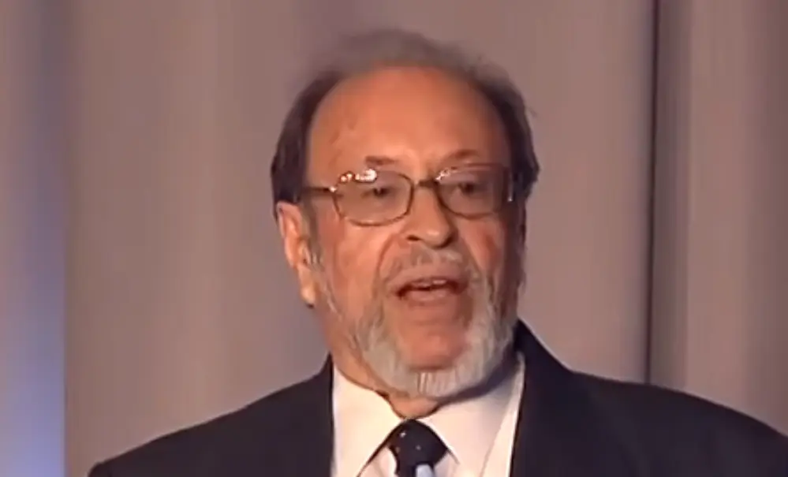
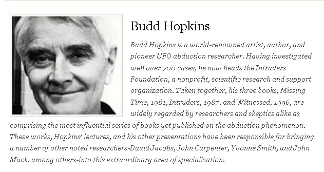

<!-- <h1 id="hidden-hand-toc">The Hidden Hand - Alien Contact and the Government Coverup</h1> -->

## [The Hidden Hand - Alien Contact and the Government Coverup](#hidden-hand-toc)

--James Carman (2008)

<!--~~~~~~~~~~~~~~~~~~~~~~~~~~~~~~~~~~~~~~~~~~~~~~~~~~~~~~~~~~~~~~~~~~~~~~~~~~~~~~~~~~~~~~~~~~~~-->
<!--~~~~~~~~~~~~~~~~ the hidden hand - alien contact and the government coverup ~~~~~~~~~~~~~~~~-->
<blockquote>
There are more things in heaven and earth, Horatio,
than are dreamt of in your philosophy.
 
- Hamlet (1.5.167-8), Hamlet to Horatio
</blockquote>

<!--~~~~~~~~~~~~~~~~~~~~~~~~~~~~~~~~~~~~~~~~~~~~~~~~~~~~~~~~~~~~~~~~~~~~~~~~~~~~~~~~~~~~~~~~~~~~-->
<!--~~~~~~~~~~~~~~~~~~~~~~~~~~~~~~~~~~~ autopsy photo ~~~~~~~~~~~~~~~~~~~~~~~~~~~~~~~~~~~~~~~~~~-->

  

&nbsp;

Long, long list of authors, abductees, officers, government whistle-blowers, experiencers, 
directors, historians, pilots, astronauts, ufologists, microbiologist, experiencers, 
researchers & contactees.

  <b><a href="#hidden-hand-toc">↥ Back To Top</a></b>

**[`^        List of Credits        ^`](#credits)**

<!--~~~~~~~~~~~~~~~~~~~~~~~~~~~~~~~~~~~~~~~~~~~~~~~~~~~~~~~~~~~~~~~~~~~~~~~~~~~~~~~~~~~~~~~~~~~~-->
<!--~~~~~~~~~~~~~~~~ the hidden hand - alien contact and the government coverup ~~~~~~~~~~~~~~~~-->
<blockquote>
The Hidden Hand is a controversial Award-winning documentary that explores the 
possibility, make that probability of an extraterrestrial presence here on Earth. 
After all, there are a trillion Earth-like planets in the Milky Way alone. The film 
takes a keen look at a spectrum of topics like alien abduction, human/alien hybridization, 
the military's reverse-engineering of alien technology and the government cover-up 
of anything related to extraterrestrials.
</blockquote>

<blockquote>
Is preoccupation with E.T.'s a form of cultural madness, or is something really going 
on? How would E.T. contact change the religious and political institutions of our 
society? The Hidden Hand is full of riveting interviews with experts and experiencers 
alike: Whitley Strieber, Dr. Edgar Mitchell, the 6th astronaut on the moon, Paul Hellyer, 
a former Canadian Defence Minister, Richard Dolan, Jim Marrs, Linda Moulton Howe, 
Col. John Alexander, Lyn Buchanan, Clifford Stone, Nassim Haramein, David Icke, 
Dr. Roger Leir, Graham Hancock and Paola Harris, among others. The shadowy world 
of UFOs is suddenly brought to light.
</blockquote>
—James Carman

...

<h3><a href="https://kevinrandle.blogspot.com/">Kevin Randle blog</a></h3>

<!--~~~~~~~~~~~~~~~~~~~~~~~~~~~~~~~~~~~~~~~~~~~~~~~~~~~~~~~~~~~~~~~~~~~~~~~~~~~~~~~~~~~~~~~~~~~~-->
<!--~~~~~~~~~~~~~~~~~~~~~~~~~~~~~~~~~~~~~ albert einstein ~~~~~~~~~~~~~~~~~~~~~~~~~~~~~~~~~~~~~~-->
<h4>Albert Einstein (1879-1955)</h4>

  

  <q cite="https://www.relicsworld.com/albert-einstein/when-you-are-courting-a-nice-girl-an-hour-seems-like-a-author-albert-einstein">You never fail until you stop trying.
  </q>
<i>― Albert Einstein</i>
  

Albert Einstein was born at Ulm, in Württemberg, Germany, on March 14, 1879. 
Six weeks later the family moved to Munich, where he later on began his schooling 
at the Luitpold Gymnasium (secondary school).

Later, they moved to Italy and Albert continued his education at Aarau, Switzerland 
and in 1896 he entered the Swiss Federal Polytechnic School in Zurich to be trained 
as a teacher in physics and mathematics.

In 1901, the year he gained his diploma, he acquired Swiss citizenship and, 
as he was unable to find a teaching post, he accepted a position as technical assistant 
in the Swiss Patent Office.

In 1905 he obtained his doctor’s degree.

Einstein’s researches are, of course, well chronicled and his more important works 
include Special Theory of Relativity (1905), Relativity (English translations, 1920 
and 1950), General Theory of Relativity (1916), Investigations on Theory of Brownian 
Movement (1926), and The Evolution of Physics (1938).

Among his non-scientific works, About Zionism (1930), Why War? (1933), My Philosophy 
(1934), and Out of My Later Years (1950) are perhaps the most important.

<blockquote>

In a recently unearthed recording of an interview conducted over 30 years ago, a 
former assistant to Albert Einstein alleges that the famed scientist was enlisted 
to examine the Roswell wreckage, including the ET occupants of the downed craft.

UFO researcher Anthony Bragalia uncovered the remarkable revelation when he 
tracked down ufologist Sheila Franklin, who interviewed Dr. Shirley Wright in 1993 
about her time working with Einstein in the summer of 1947.

As luck would have it, Franklin still had the tapes from her conversation with 
the former assistant and what she told the researcher was nothing short of stunning.

</blockquote>

<blockquote>

According to Wright, she accompanied Einstein to what had been dubbed a "crisis 
conference" that was hastily held in July of 1947 at a remote army airbase in the 
American southwest.

Upon their arrival, the duo entered a hangar that was under heavy security and, 
when they entered the building, they discovered that it contained a rather curious 
craft that appeared to have sustained significant damage.

"It was disc-shaped, sort of concave," Wright recalled, "its size stood up to 
one-fourth of the hangar floor."

While her response to the strange scene was one of "wonderment, half curiosity 
and maybe half fear," she said that Einstein was "not disturbed at all" and, instead, 
was primarily concerned with what sort of insights about propulsion and the universe 
could be gleaned from the vehicle.

</blockquote>

The year of this Einstein quote (1952) is more than interesting.  It is the same 
year that the Robertson Panel (on which Einstein’s associate Goudsmit served) was 
planned.  It was also the same year that mass UFO sightings were occurring with 
frequency over Washington, DC.  And it was the same year that Frank Edwards maintained 
Einstein had warned the President about attacking the saucers.

 

What is more interesting about the Einstein quote is what is not said.  Though 
Einstein admits that there is reality to the phenomena ("These people are seeing 
something"), he says that he does not want to know just what it is that the people 
are seeing. This is of course disingenuous of Einstein.  Since when does science 
shy away from encouraging finding solutions to mysteries?

Einstein’s own friend and associate Goudsmit certainly was interested in the 
phenomena during the same time period Einstein was writing Gardner about it!

It sounds more like Einstein simply does not wish to engage someone outside of 
his circle on this obviously sensitive matter.

 

Another interpretation is that Einstein really did not want to know because he was 
afraid to know.  And this makes sense.  If what Edwards says is true, Einstein feared 
the phenomenon.

But what he feared more was us.  Einstein feared our potential for a war-like reaction 
to the continued flyovers of craft that were piloted by beings that were not from here 
and that were unknown to science.

  <b><a href="#hidden-hand-toc">↥ Back To Top</a></b>

...

<!--~~~~~~~~~~~~~~~~~~~~~~~~~~~~~~~~~~~~~~~~~~~~~~~~~~~~~~~~~~~~~~~~~~~~~~~~~~~~~~~~~~~~~~~~~~~~-->
<!--~~~~~~~~~~~~~~~~~~~~~~~~~~~~~~~~~~~~~~ victor hugo ~~~~~~~~~~~~~~~~~~~~~~~~~~~~~~~~~~~~~~~~~-->
<h4>Victor Hugo (Feb/1802 - May/1885)</h4>

  - Poet, novelist. Les Misérables (1862), and dramatist

<blockquote>
Victor Hugo, in full Victor-Marie Hugo, (born February 26, 1802, Besançon, France—died 
May 22, 1885, Paris), poet, novelist, and dramatist who was the most important of the 
French Romantic writers. Though regarded in France as one of that country’s greatest 
poets, he is better known abroad for such novels as Notre-Dame de Paris (1831) and 
Les Misérables (1862).
</blockquote>

  <b><a href="#hidden-hand-toc">↥ Back To Top</a></b>

 
...

<!--~~~~~~~~~~~~~~~~~~~~~~~~~~~~~~~~~~~~~~~~~~~~~~~~~~~~~~~~~~~~~~~~~~~~~~~~~~~~~~~~~~~~~~~~~~~~-->
<!--~~~~~~~~~~~~~~~~~~~~~~~~~~~~~~~~~~~~~~~ harry reid ~~~~~~~~~~~~~~~~~~~~~~~~~~~~~~~~~~~~~~~~~-->
<h4>Harry Reid - (Dec/1939-Dec/2021)</h4>

  

<h3>Career</h3

Police officer at U.S. Capitol, c. 1961-63; city attorney, Henderson, NV, 1964-66; Nevada state assemblyman, 1969-1970; Nevada lieutenant governor, 1970-74; ran for U.S. Senate but lost, 1974; chairman of the Nevada Gaming Commission, 1977-81; attorney in private practice, 1981-83; congressman, 1983-87; U.S. senator, 1987—; Senate Democratic Whip, 1998-2004; Senate Majority Leader, 2005—2015.  And Senate Minority Leader until 2017.

I love supporting the **[EFF](https://eff.org)**.
This is the *[Markdown Guide](https://www.markdownguide.org)*.
See the section on [`code`](#code).

Read more: **[Harry Reid](https://www.notablebiographies.com/newsmakers2/2006-Ra-Z/Reid-Harry.html#ixzz7Ik2R5aRj)**

<!--~~~~~~~~~~~~~~~~~~~~~~~~~~~~~~~~~~~~~~~~~~~~~~~~~~~~~~~~~~~~~~~~~~~~~~~~~~~~~~~~~~~~~~~~~~~~-->
<!--~~~~~~~~~~~~~~~~~~~~~~~~~~~~~~~~~~~~~~ chuck weiss ~~~~~~~~~~~~~~~~~~~~~~~~~~~~~~~~~~~~~~~~~-->
<h4>Chuck Weiss</h4>

   - Author. How I Learned to Cope with High Strangeness...

How I Learned to Cope with High Strangeness, Government Harrassment, and My Mother (a True Story)

  <b><a href="#hidden-hand-toc">↥ Back To Top</a></b>

[**`^        back to top        ^`**](#hidden-hand-toc)

...

<!--~~~~~~~~~~~~~~~~~~~~~~~~~~~~~~~~~~~~~~~~~~~~~~~~~~~~~~~~~~~~~~~~~~~~~~~~~~~~~~~~~~~~~~~~~~~~-->
<!--~~~~~~~~~~~~~~~~~~~~~~~~~~~~~~~~~~~~~~ richard dolan ~~~~~~~~~~~~~~~~~~~~~~~~~~~~~~~~~~~~~~~-->
<h4>Richard Dolan (7/1962)</h4>

   - Author. UFOs & The National Security State

Richard M. Dolan is a gifted historian whose study of U.S. Cold War strategy led 
him to the broader context of increased security measures and secrecy since World 
War II. One aspect of such government policies that has continued to hold the public's 
imagination for over half a century is the question of unidentified flying objects.

UFOs and the National Security State is the first volume of a two-part detailed 
chronological narrative of the national security dimensions of the UFO phenomenon 
from 1941 to the present. Working from hundreds of declassified records and other 
primary and secondary sources, Dolan centers his investigation on the American 
military and intelligence communities, demonstrating that they take UFOs seriously 
indeed.

Included in this volume are the activities of more than fifty military bases relating 
to UFOs, innumerable violations of sensitive airspace by unknown craft and analyses 
of the Roswell controversy, the CIA-sponsored Robertson Panel, and the Condon Committee 
Report. Dolan highlights the development of civilian anti-secrecy movements, which 
flourished in the 1950s and 1960s until the adoption of an official government policy 
and subsequent "closing of the door" during the Nixon administration.

  <b><a href="#hidden-hand-toc">↥ Back To Top</a></b>

...

<!--~~~~~~~~~~~~~~~~~~~~~~~~~~~~~~~~~~~~~~~~~~~~~~~~~~~~~~~~~~~~~~~~~~~~~~~~~~~~~~~~~~~~~~~~~~~~-->
<!--~~~~~~~~~~~~~~~~~~~~~~~~~~~~~~~~~~~~ whitley streiber ~~~~~~~~~~~~~~~~~~~~~~~~~~~~~~~~~~~~~~-->
<h4>Whitley Strieber</h4>

   - Author, Communion

[Whitley Strieber and CIA intelligence officer](https://www.unknowncountry.com/dreamland/an-intelligence-officer-with-a-stunning-story-to-tell/ 'Whitley Strieber Web Site')

  <b><a href="#hidden-hand-toc">↥ Back To Top</a></b>

 

<!--~~~~~~~~~~~~~~~~~~~~~~~~~~~~~~~~~~~~~~~~~~~~~~~~~~~~~~~~~~~~~~~~~~~~~~~~~~~~~~~~~~~~~~~~~~~~-->
<!--~~~~~~~~~~~~~~~~~~~~~~~~~~~~~~~~~~~~~~~ robert dean ~~~~~~~~~~~~~~~~~~~~~~~~~~~~~~~~~~~~~~~~-->
<h4>Robert Dean</h4>

   - Retired U.S. Army Command Sergeant Major

  <b><a href="#hidden-hand-toc">↥ Back To Top</a></b>

As a retired command Sergeant Major, Robert O. Dean's history includes forty years 
of research in the UFO field. He spent twenty-seven years of active duty in the US 
Army where he retired as Command Sergeant Major after serving as a highly decorated 
infantry combat veteran. He also served in Intelligence Field Operations and was 
stationed at Supreme Headquarters Allied Powers Europe (SHAPE), the military arm of NATO.

<!--~~~~~~~~~~~~~~~~~~~~~~~~~~~~~~~~~~~~~~~~~~~~~~~~~~~~~~~~~~~~~~~~~~~~~~~~~~~~~~~~~~~~~~~~~~~~-->
<!--~~~~~~~~~~~~~~~~~~~~~~~~~~~~~~~~~~~~ stanton friedman ~~~~~~~~~~~~~~~~~~~~~~~~~~~~~~~~~~~~~~-->
<h4>Stanton Friedman</h4>

   - Author, Flying Saucers & Science

<h4>THE UFO CHALLENGE</h4>

December 1997
By Stanton T. Friedman

As a nuclear physicist who has had a serious interest in flying saucers since 1958, 
I have reached four major conclusions:
The evidence is overwhelming that Planet Earth is being visited by intelligently 
controlled extraterrestrial spacecraft. In other words, SOME UFOs are alien spacecraft. 
Most are not.

The subject of flying saucers represents a kind of Cosmic Watergate, meaning that 
some few people in major governments have known since July, 1947, when two crashed 
saucers and several alien bodies were recovered in New Mexico, that indeed SOME 
UFOs are ET. As noted in 1950, it’s the most classified U.S. topic.

None of the arguments made against conclusions One and Two by a small group of 
debunkers such as Carl Sagan, my University of Chicago classmate for three years, 
can stand up to careful scrutiny.

The Flying Saucer story is the biggest story of the millennium: visits to Planet 
Earth by aliens and the U.S. government’s cover-up of the best data (the bodies 
and wreckage) for over fifty years.
slide show
Since 1967 I have lectured on the subject “Flying Saucers ARE Real” at more than 
600 colleges and over 100 professional groups in all fifty US states, nine Canadian 
Provinces, twelve cities in England and nine in other countries, with only eleven 
hecklers. I have also appeared on hundreds of radio and TV shows. Overall, I have 
probably answered about 35,000 questions about UFOs and secrecy.

It’s clear that over 97% of the people have NOT read any of the five major scientific 
studies I discuss, and are unaware of the mountains of evidence that support my conclusions. 
They are also unaware of the scientific data, as opposed to tabloid nonsense. However, 
it is also clear from the Opinion Polls and from my own experience that indeed most people 
accept the notion that SOME UFOs are alien spacecraft. The greater the education, the MORE 
likely an individual is to accept this proposition. In an October 25, 1995, Oxford 
University Debate on the resolution “Planet Earth is being visited by intelligent 
extraterrestrial life,” the affirmative side, of which I was a part, garnered 60% 
of Debate Union Member votes on the question. Ninety-two percent of 100,000 people 
calling during a TV Debate in London on June 27, 1997, said Earth has been visited 
by aliens!

The problem is NOT that there is not enough evidence to justify my conclusions; 
but that most people, especially the noisy negativists, are unaware of the real, 
non-tabloid evidence.

Debunkers seem to employ four major rules:
What the public doesn’t know, we certainly won’t tell them. The largest official 
USAF UFO study isn’t even mentioned in twelve anti-UFO books, though every one 
of those books’ authors was aware of it.

Don’t bother me with the facts, my mind is made up.

If one can’t attack the data, attack the people. It is easier.

Do one’s research by proclamation rather than investigation. It is much easier, 
and nobody will know the difference anyway.
Many major media people will concede that if indeed aliens are visiting earth, 
that would be a major story. But because they take great pride in their KNOWLEDGE 
of major stories, if this were happening they would know about it. But they don’t. 
Therefore, anybody who says visits are real must be a crackpot.

I have noted four major reasons why the big names in science and journalism haven’t 
jumped on the pro-UFO bandwagon:
Ignorance of the data. Scratch a debunker and one usually finds somebody who is 
putting down what he is not up on.

Fear of ridicule in sponsoring a thesis (only about ten have been submitted relating 
to UFOs) if a professor, or sponsoring a detailed reportorial investigation if an 
editor. I check all my audiences and find that, while in agreement with polls, 10% 
have had a sighting but only 5-10% of these witnesses have been willing to report 
what they saw. Biggest reason? Fear of ridicule.

Ego. If aliens were visiting Earth, they would call a press conference or ask to 
talk to the National Academy of Sciences. They haven’t, so aliens must not be visiting. 
Flying saucers finish the job Copernicus started in taking man out of the middle 
of the universe. Priests fought Copernicus’s ideas. Today guys in lab coats, rather 
than priestly robes, fight alien visitations.

Failure to use our knowledge of technology to understand UFO behavior. They say 
“It is impossible,” rather than “I don’t know how.” Despite the absurd claims of 
certain ancient academics and fossilized physicists, it is clear on the basis of 
solid engineering studies that trips to nearby stars are feasible with round trip 
times shorter than the average person’s lifetime — using, for example, staged fission 
and fusion propulsion systems. I have worked on both. It’s clear that technological 
progress comes from doing things differently in an unpredictable way. The history 
of science is littered with challenges, leveled by people who know nothing about 
the job at hand, against traditionally “impossible” claims.
The cult of S.E.T.I. (Silly Effort To Investigate) with its crazy notions that 
nobody would travel — but that aliens, stuck at the level of radio, are trying 
to attract our attention — mocks the notion of flying saucers, not by dealing with 
the evidence, but by proclamations about the ABSENCE of evidence. This ignores 
science.

I prove at every lecture that the NSA and CIA are withholding UFO data. Having 
worked under security for fourteen years, visited seventeen document archives, 
and having become aware of the huge black budgets of the NSA, NRO, CIA, DIA, etc., 
I know how easy it is to keep secrets. My nineteen years of study about crashed 
saucers, and thirteen years on the Majestic-12 documents have convinced me these 
are real. The challenge for us all, as we enter the new millennium, is to recognize 
that while our future is in space, we are not alone. I truly hope we qualify for 
admission to the Cosmic Kindergarten.

Stanton Friedman
 
 

  <b><a href="#hidden-hand-toc">↥ Back To Top</a></b>

<!--~~~~~~~~~~~~~~~~~~~~~~~~~~~~~~~~~~~~~~~~~~~~~~~~~~~~~~~~~~~~~~~~~~~~~~~~~~~~~~~~~~~~~~~~~~~~-->
<!--~~~~~~~~~~~~~~~~~~~~~~~~~~~~~~~~~~~~~~ paola harris ~~~~~~~~~~~~~~~~~~~~~~~~~~~~~~~~~~~~~~~~-->
<h4>Paola Harris</h4>

   - Author, Connecting the Dots

Italian investigative journalist Paola Leopizzi Harris and French-born information 
scientist Dr. Jacques F. Vallée have teamed up to uncover the details of a New Mexico 
crash in 1945, fully two years before the well-known incident at Roswell and the 
famous sighting by pilot Kenneth Arnold in 1947.

Latest News
The Evolution of Jacques Vallée A personal reflection by Paola Harris, investigative 
reporter and photojournalist In August of 2020, we all went Le Marais…

Links & Resources
Exopolitics Italy is a website created by Paola Harris, MEd., for various Exopolitics 
initiatives in Italy. Paola is author of Exopolitics: How Do You Speak to…
 
Interviews
The Evolution of Jacques Vallée A personal reflection by Paola Harris, investigative 
reporter and photojournalist In August of 2020, we all went Le Marais…
 
Contact
Paola Harris on GAIA “Open Minds:” Watch “Secrets of Contact” on GAIA Open Minds: 
View this “Beyond Belief” episode: HELP FUND PAOLA’S FIELD RESEARCH!

  <b><a href="#hidden-hand-toc">↥ Back To Top</a></b>

<!--~~~~~~~~~~~~~~~~~~~~~~~~~~~~~~~~~~~~~~~~~~~~~~~~~~~~~~~~~~~~~~~~~~~~~~~~~~~~~~~~~~~~~~~~~~~~-->
<!--~~~~~~~~~~~~~~~~~~~~~~~~~~~~~~~~~~~~~~ joni strother ~~~~~~~~~~~~~~~~~~~~~~~~~~~~~~~~~~~~~~~-->
<h4>Joni Strother</h4>

   - Abductee

Abductee Joni Strother described her traumatic encounters with the aliens, whom 
she views as sinister entities. Over the years, she believes she's mothered five 
hybrid children and during a recent abduction she was shown a hybrid camp being 
guarded by soldiers. There were some 500 hybrids there, and in her interactions 
with them, they inquired about basic skills such as personal hygiene and how to 
cook.

  <b><a href="#hidden-hand-toc">↥ Back To Top</a></b>

<!--~~~~~~~~~~~~~~~~~~~~~~~~~~~~~~~~~~~~~~~~~~~~~~~~~~~~~~~~~~~~~~~~~~~~~~~~~~~~~~~~~~~~~~~~~~~~-->
<!--~~~~~~~~~~~~~~~~~~~~~~~~~~~~~~~~~~~~~~~ roger leir ~~~~~~~~~~~~~~~~~~~~~~~~~~~~~~~~~~~~~~~~~-->
<h4>Roger Leir</h4>

   - Author, The Aliens and the Scalpel

<!-- https://user-images.githubusercontent.com/41387907/140461982-e6ae97f6-b8fa-44bb-a1b9-ad86d7601e92.png" -->

Dr. Roger K. Leir is one of the world's most important leaders in physical evidence 
research involving the field of Ufology. In this special session he will reveal 
scientific proof that WE ARE NOT ALONE.  Dr. Leir is a podiatric surgeon, in private 
practice for the past 43 years and has written numerous books including The Aliens 
and the Scalpel,  UFO Crash in Brazil, and Casebook Alien Implants.
 

  <b><a href="#hidden-hand-toc">↥ Back To Top</a></b>

...

<!--~~~~~~~~~~~~~~~~~~~~~~~~~~~~~~~~~~~~~~~~~~~~~~~~~~~~~~~~~~~~~~~~~~~~~~~~~~~~~~~~~~~~~~~~~~~~-->
<!--~~~~~~~~~~~~~~~~~~~~~~~~~~~~~~~~~~~~~~~ jim sparks ~~~~~~~~~~~~~~~~~~~~~~~~~~~~~~~~~~~~~~~~~-->
<h4>Jim Sparks</h4>

  - Author, The Keepers

  <b><a href="#hidden-hand-toc">↥ Back To Top</a></b>

<!--~~~~~~~~~~~~~~~~~~~~~~~~~~~~~~~~~~~~~~~~~~~~~~~~~~~~~~~~~~~~~~~~~~~~~~~~~~~~~~~~~~~~~~~~~~~~-->
<!--~~~~~~~~~~~~~~~~~~~~~~~~~~~~~~~~~~~~~~ niara isley ~~~~~~~~~~~~~~~~~~~~~~~~~~~~~~~~~~~~~~~~~-->
<h4>Niara Isley</h4>

  - Abductee

[Encounters with Healing](https://encounterswithhealing.com/)

  <b><a href="#hidden-hand-toc">↥ Back To Top</a></b>

<!--~~~~~~~~~~~~~~~~~~~~~~~~~~~~~~~~~~~~~~~~~~~~~~~~~~~~~~~~~~~~~~~~~~~~~~~~~~~~~~~~~~~~~~~~~~~~-->
<!--~~~~~~~~~~~~~~~~~~~~~~~~~~~~~~~~~~~~~~ lyn buchanan ~~~~~~~~~~~~~~~~~~~~~~~~~~~~~~~~~~~~~~~~-->
<h4>Lyn Buchanan</h4>

  - Director, The PSI Institute

  <b><a href="#hidden-hand-toc">↥ Back To Top</a></b>

<!--~~~~~~~~~~~~~~~~~~~~~~~~~~~~~~~~~~~~~~~~~~~~~~~~~~~~~~~~~~~~~~~~~~~~~~~~~~~~~~~~~~~~~~~~~~~~-->
<!--~~~~~~~~~~~~~~~~~~~~~~~~~~~~~~~~~~~~~ nassim haramein ~~~~~~~~~~~~~~~~~~~~~~~~~~~~~~~~~~~~~~-->
<h4>Nassim Haramein</h4>

  - Director, The Resonance Project Foundation

  <b><a href="#hidden-hand-toc">↥ Back To Top</a></b>

<!--~~~~~~~~~~~~~~~~~~~~~~~~~~~~~~~~~~~~~~~~~~~~~~~~~~~~~~~~~~~~~~~~~~~~~~~~~~~~~~~~~~~~~~~~~~~~-->
<!--~~~~~~~~~~~~~~~~~~~~~~~~~~~~~~~~~~~~~~~ david jacobs ~~~~~~~~~~~~~~~~~~~~~~~~~~~~~~~~~~~~~~~-->
<h4>David Jacobs</h4>

  - Historian & Hypnotherapist
  
  - "It's a club no one wants to belong to.", regarding Alien Abductions.

  

  <b><a href="#hidden-hand-toc">↥ Back To Top</a></b>

<!--~~~~~~~~~~~~~~~~~~~~~~~~~~~~~~~~~~~~~~~~~~~~~~~~~~~~~~~~~~~~~~~~~~~~~~~~~~~~~~~~~~~~~~~~~~~~-->
<!--~~~~~~~~~~~~~~~~~~~~~~~~~~~~~~~~~~~~~~~~ nick pope ~~~~~~~~~~~~~~~~~~~~~~~~~~~~~~~~~~~~~~~~~-->
<h4>Nick Pope</h4>

  - Former Head of the British Government's UFO Project

  <b><a href="#hidden-hand-toc">↥ Back To Top</a></b>

...

<!--~~~~~~~~~~~~~~~~~~~~~~~~~~~~~~~~~~~~~~~~~~~~~~~~~~~~~~~~~~~~~~~~~~~~~~~~~~~~~~~~~~~~~~~~~~~~-->
<!--~~~~~~~~~~~~~~~~~~~~~~~~~~~~~~~~~~~~~~ milton torres ~~~~~~~~~~~~~~~~~~~~~~~~~~~~~~~~~~~~~~~-->
<h4>Milton Torres</h4>
  
  - Former USAF Fighter Pilot & Astronaut

  <b><a href="#hidden-hand-toc">↥ Back To Top</a></b>

...

<!--~~~~~~~~~~~~~~~~~~~~~~~~~~~~~~~~~~~~~~~~~~~~~~~~~~~~~~~~~~~~~~~~~~~~~~~~~~~~~~~~~~~~~~~~~~~~-->
<!--~~~~~~~~~~~~~~~~~~~~~~~~~~~~~~~~~~~~~ edgar mitchell ~~~~~~~~~~~~~~~~~~~~~~~~~~~~~~~~~~~~~~~-->
<h4>Edgar D. Mitchell</h4>

  - Former Astronaut, 6th man on the moon

https://www.imdb.com/name/nm0593307/?ref_=tt_cl_i_16

  <b><a href="#hidden-hand-toc">↥ Back To Top</a></b>

...

<!--~~~~~~~~~~~~~~~~~~~~~~~~~~~~~~~~~~~~~~~~~~~~~~~~~~~~~~~~~~~~~~~~~~~~~~~~~~~~~~~~~~~~~~~~~~~~-->
<!--~~~~~~~~~~~~~~~~~~~~~~~~~~~~~~~~~~~~~ james penniston ~~~~~~~~~~~~~~~~~~~~~~~~~~~~~~~~~~~~~~-->
<h4>James Penniston</h4>

 - Sergeant USAF Retired

  <b><a href="#hidden-hand-toc">↥ Back To Top</a></b>

...

<!--~~~~~~~~~~~~~~~~~~~~~~~~~~~~~~~~~~~~~~~~~~~~~~~~~~~~~~~~~~~~~~~~~~~~~~~~~~~~~~~~~~~~~~~~~~~~-->
<!--~~~~~~~~~~~~~~~~~~~~~~~~~~~~~~~~~~~~~~~ david icke ~~~~~~~~~~~~~~~~~~~~~~~~~~~~~~~~~~~~~~~~~-->
<h4>David Icke</h4>
  
  - Author, The Biggest Secret

  <b><a href="#hidden-hand-toc">↥ Back To Top</a></b>

...

<!--~~~~~~~~~~~~~~~~~~~~~~~~~~~~~~~~~~~~~~~~~~~~~~~~~~~~~~~~~~~~~~~~~~~~~~~~~~~~~~~~~~~~~~~~~~~~-->
<!--~~~~~~~~~~~~~~~~~~~~~~~~~~~~~~~~~~~~~ jaime maussan ~~~~~~~~~~~~~~~~~~~~~~~~~~~~~~~~~~~~~~~~-->
<h4>Jaime Maussan</h4>
  
  - TV Producer

  

  <b><a href="#hidden-hand-toc">↥ Back To Top</a></b>

...

<!--~~~~~~~~~~~~~~~~~~~~~~~~~~~~~~~~~~~~~~~~~~~~~~~~~~~~~~~~~~~~~~~~~~~~~~~~~~~~~~~~~~~~~~~~~~~~-->
<!--~~~~~~~~~~~~~~~~~~~~~~~~~~~~~~~~~~~ john b. alexander ~~~~~~~~~~~~~~~~~~~~~~~~~~~~~~~~~~~~~~-->
<h4>John B. Alexander</h4>
   
  - Non-Lethal Weapons Specialist (as Col. John B. Alexander)

  

  <b><a href="#hidden-hand-toc">↥ Back To Top</a></b>

...

<!--~~~~~~~~~~~~~~~~~~~~~~~~~~~~~~~~~~~~~~~~~~~~~~~~~~~~~~~~~~~~~~~~~~~~~~~~~~~~~~~~~~~~~~~~~~~~-->
<!--~~~~~~~~~~~~~~~~~~~~~~~~~~~~~~~~~~~~~~ paul hellyer ~~~~~~~~~~~~~~~~~~~~~~~~~~~~~~~~~~~~~~~~-->
<h4>Paul Hellyer</h4>
  
  - Former Canadian Defense Secretary

  

  <b><a href="#hidden-hand-toc">↥ Back To Top</a></b>

...

<!--~~~~~~~~~~~~~~~~~~~~~~~~~~~~~~~~~~~~~~~~~~~~~~~~~~~~~~~~~~~~~~~~~~~~~~~~~~~~~~~~~~~~~~~~~~~~-->
<!--~~~~~~~~~~~~~~~~~~~~~~~~~~~~~~~~~~~~~~~ charles hall ~~~~~~~~~~~~~~~~~~~~~~~~~~~~~~~~~~~~~~~-->
<h4>Charles Hall</h4>
  
  - Retired US Army Duty Weather Observer

  

  <b><a href="#hidden-hand-toc">↥ Back To Top</a></b>

...

<!--~~~~~~~~~~~~~~~~~~~~~~~~~~~~~~~~~~~~~~~~~~~~~~~~~~~~~~~~~~~~~~~~~~~~~~~~~~~~~~~~~~~~~~~~~~~~-->
<!--~~~~~~~~~~~~~~~~~~~~~~~~~~~~~~~~~~~~ david huggins ~~~~~~~~~~~~~~~~~~~~~~~~~~~~~~~~~~~~~~~~~-->
<h4>David Huggins</h4>
  
  - Painter & Experiencer

  

  <b><a href="#hidden-hand-toc">↥ Back To Top</a></b>

...

<!--~~~~~~~~~~~~~~~~~~~~~~~~~~~~~~~~~~~~~~~~~~~~~~~~~~~~~~~~~~~~~~~~~~~~~~~~~~~~~~~~~~~~~~~~~~~~-->
<!--~~~~~~~~~~~~~~~~~~~~~~~~~~~~~~~~~~~~ clifford e. stone ~~~~~~~~~~~~~~~~~~~~~~~~~~~~~~~~~~~~~-->
<h4>Clifford E. Stone</h4>
  
  - Retired US Army Sergeant

  

  <b><a href="#hidden-hand-toc">↥ Back To Top</a></b>

...

<!--~~~~~~~~~~~~~~~~~~~~~~~~~~~~~~~~~~~~~~~~~~~~~~~~~~~~~~~~~~~~~~~~~~~~~~~~~~~~~~~~~~~~~~~~~~~~-->
<!--~~~~~~~~~~~~~~~~~~~~~~~~~~~~~~~~~~~~~ derrel w. sims ~~~~~~~~~~~~~~~~~~~~~~~~~~~~~~~~~~~~~~~-->
<h4>Derrel W. Sims</h4>
  
  - Private Investigator

  

  <b><a href="#hidden-hand-toc">↥ Back To Top</a></b>

...

<!--~~~~~~~~~~~~~~~~~~~~~~~~~~~~~~~~~~~~~~~~~~~~~~~~~~~~~~~~~~~~~~~~~~~~~~~~~~~~~~~~~~~~~~~~~~~~-->
<!--~~~~~~~~~~~~~~~~~~~~~~~~~~~~~~~~~~~~ james gilliland ~~~~~~~~~~~~~~~~~~~~~~~~~~~~~~~~~~~~~~~-->
<h4>James Gilliland</h4>
  
  - Director, ECETI

  

  <b><a href="#hidden-hand-toc">↥ Back To Top</a></b>

...

<!--~~~~~~~~~~~~~~~~~~~~~~~~~~~~~~~~~~~~~~~~~~~~~~~~~~~~~~~~~~~~~~~~~~~~~~~~~~~~~~~~~~~~~~~~~~~~-->
<!--~~~~~~~~~~~~~~~~~~~~~~~~~~~~~~~~~~~~~~ budd hopkins ~~~~~~~~~~~~~~~~~~~~~~~~~~~~~~~~~~~~~~~~-->
<h4>Budd Hopkins</h4>

  - Ufologist

  <b><a href="#hidden-hand-toc">↥ Back To Top</a></b>

...

<!--~~~~~~~~~~~~~~~~~~~~~~~~~~~~~~~~~~~~~~~~~~~~~~~~~~~~~~~~~~~~~~~~~~~~~~~~~~~~~~~~~~~~~~~~~~~~-->
<!--~~~~~~~~~~~~~~~~~~~~~~~~~~~~~~~~~~~~ philip j. corso ~~~~~~~~~~~~~~~~~~~~~~~~~~~~~~~~~~~~~~~-->

  

<h4>Philip J. Corso</h4>

  - Chief of Pentagon Foreign Technology Desk (archive footage)

  

<h4>Background</h4>
Philip James Corso (May 22, 1915 – July 16, 1998) was an American Army officer.

He served in the United States Army from February 23, 1942, to March 1, 1963, and 
earned the rank of Lieutenant Colonel.

Corso published The Day After Roswell, about how he was involved in the research of 
extraterrestrial technology recovered from the 1947 Roswell UFO Incident. On July 23, 
1997, he was a guest on the popular late night radio show, Coast to Coast AM with Art 
Bell where he spoke live about his Roswell story. This interview was rebroadcast by 
Coast to Coast AM on July 3, 2010.

<h4>The Day After Roswell</h4>
In his book The Day After Roswell (co-author William J. Birnes) claims he stewarded 
extraterrestrial artifacts recovered from a crash near Roswell, New Mexico, in 1947.

Corso says a covert government group was assembled under the leadership of the first 
Director of Central Intelligence, Adm. Roscoe H. Hillenkoetter. Among its tasks was 
to collect all information on off-planet technology. The US administration simultaneously 
discounted the existence of flying saucers in the eyes of the public, Corso says.

According to Corso, the reverse engineering of these artifacts indirectly led to 
the development of accelerated particle beam devices, fiber optics, lasers, integrated 
circuit chips and Kevlar material.

In the book, Corso claims the Strategic Defense Initiative (SDI), or “Star Wars”, 
was meant to achieve the destructive capacity of electronic guidance systems in 
incoming enemy warheads, as well as the disabling of enemy spacecraft, including 
those of extraterrestrial origin.

Different parts of the Roswell craft were sent to various defense companies, who 
reverse engineered their properties. This engineering feat eventually led to a number 
of breakthroughs. Among them were integrated circuitry, night vision equipment, the 
laser, particle beams, and fiber optics. The contractors were told that the parts 
were stolen from Russia.

  <b><a href="#hidden-hand-toc">↥ Back To Top</a></b>

...

<!--~~~~~~~~~~~~~~~~~~~~~~~~~~~~~~~~~~~~~~~~~~~~~~~~~~~~~~~~~~~~~~~~~~~~~~~~~~~~~~~~~~~~~~~~~~~~-->
<!--~~~~~~~~~~~~~~~~~~~~~~~~~~~~~~~~~~~~ gordon novel ~~~~~~~~~~~~~~~~~~~~~~~~~~~~~~~~~~~~~~~~~~-->
<h4>Gordon Novel</h4>

  - Self - Former CIA Operative

Gordon Novel is a fascinating man. Carried along on the train of history, Gordon 
Novel has had a front seat to many of the most controversial chapters in U.S. history. 
From the Kennedy assassination to Watergate, Waco and beyond, Gordon has really 
seen it all. In his first interview for over a decade, he gives us a glimpse of 
his role and perspective on a multitude of subjects including; the Vietnam war, 
Saddam Hussein and his trial, Majestic and the CIA, UFOs, the 'Extraterrestrial 
Revolution' and much more.
   
He is charming, bold, uncompromising in his vision and determined to change the 
world. We are given a special look at Gordon's new quest to bring free energy to 
the world, along with news of his proposed motion picture in development, KINGDOMS 
COME, in a deal being brokered with some of the biggest names in Hollywood. With 
the support of the CIA, he believes his vision of a world set free from the confines 
of oil and gas will become a reality. A big picture thinker with a strong will and 
an indomitable spirit, he is forging ahead against all odds. His fierce dedication 
is something to behold and we wish him every success in his quest.

  <b><a href="#hidden-hand-toc">↥ Back To Top</a></b>

...

<!--~~~~~~~~~~~~~~~~~~~~~~~~~~~~~~~~~~~~~~~~~~~~~~~~~~~~~~~~~~~~~~~~~~~~~~~~~~~~~~~~~~~~~~~~~~~~-->
<!--~~~~~~~~~~~~~~~~~~~~~~~~~~~~~~~~~~~~~~~ jim marrs ~~~~~~~~~~~~~~~~~~~~~~~~~~~~~~~~~~~~~~~~~~-->
<h4>Jim Marrs</h4>

  - Self - Author, Alien Agenda

  <b><a href="#hidden-hand-toc">↥ Back To Top</a></b>

...

<!--~~~~~~~~~~~~~~~~~~~~~~~~~~~~~~~~~~~~~~~~~~~~~~~~~~~~~~~~~~~~~~~~~~~~~~~~~~~~~~~~~~~~~~~~~~~~-->
<!--~~~~~~~~~~~~~~~~~~~~~~~~~~~~~~~~~~~ linda moulton howe ~~~~~~~~~~~~~~~~~~~~~~~~~~~~~~~~~~~~~-->
<h4>Linda Moulton Howe</h4>

  - Self - TV Producer

  <b><a href="#hidden-hand-toc">↥ Back To Top</a></b>

...

<!--~~~~~~~~~~~~~~~~~~~~~~~~~~~~~~~~~~~~~~~~~~~~~~~~~~~~~~~~~~~~~~~~~~~~~~~~~~~~~~~~~~~~~~~~~~~~-->
<!--~~~~~~~~~~~~~~~~~~~~~~~~~~~~~~~~~~~~~~~ dan burisch ~~~~~~~~~~~~~~~~~~~~~~~~~~~~~~~~~~~~~~~~-->
<h4>Dan Burisch</h4>

  - Retired Government Microbiologist

<h5>Introduction</h5>

I came to know Dr. Dan Burisch (formerly Dan Crain, Ph.D.) many years ago in Las 
Vegas NV. He and his family became friends with my family and I.... and eventually 
I came to know his story well. He asked me, in 1997 to write a book about one of 
his research projects. That became Eagles Disobey: The Case for Inca City, Mars 
and was released to the public in 1998. During that work I came to know a great 
deal about Dan's involvement in dark projects that are covertly funded by our 
military and governmen bodies - including his work up at Area-51, or as it is 
known by those who work up there: Watertown Strip. Dan became afraid, desperately 
afraid for his life toward the end of the work on Eagles Disobey. He was terrified 
of retailiation from his dark project supervisors because he refused to stop looking 
into the anomalies on Mars - and because he had shared with me many of his experiences 
"up north" while he was employed in Project Aquarius, and had familiarity with Project 
Sigma, and Looking Glass.

Toward the end of 1998 Dan disappeared. His residence was abandoned overnight, and 
nobody seemed to know where he had been taken. He turned up half way across the country, 
with most of his memories concerning his association with me and our work on Eagles 
Disobey altered or erased. I tried my best to remind him of his past, but he did not 
believe me until I showed him a copy of the book and photographs of himself sitting 
on my couch playing with the dogs. He returned to his new location, but memories 
started to break through the conditioning to such an extent that Dan fled and was 
eventually recaptured and whisked off to a military base for re-conditioning. When 
they realized that they couldn't keep it up with out damaging his ability to think 
and function (remember, they wanted him to continue to work for them in his capacity 
as team leader and microbiologist) they decided to re-wind his memories and return 
him to Las Vegas under the careful observation of his spouse, who relays all communication 
up the pipeline, and signs much of her correspondence with her title/designation PsiOpSec.

I was permitted very limited contact with him during that time, mostly because he 
made life unbearable until they honored his demand to talk to me. But he was eventually 
moved again and housed at the Papoose Lab facility where he could conduct critical 
biological studies on captive entity they had housed in their lab, on Level-5. Contact 
was intermittent, but then, in early 2001 I got a strange email that caught my attention. 
It was from mj01@missilemail.com. Since I knew that Dan was involved with Majestic and 
MJ12, I was immediately on alert. It turned out to be from a person inside the project 
Dan was working on, who was so upset with the situation that he felt compelled to seek 
my help. He was aware of my identity and long standing friendship with Dan because it 
was contained in the briefings he got prior to accepting his assignment, and figured 
I might be willing to assist. My contact is now dead. He was discovered communicating 
with me, and was involuntarily "retired". His letters read as follows, and give a 
troubling glimpse into the prison-like world that was created to maintain control 
of Dr. Dan Burisch and force him to comply with the wishes of the 'powers that be' 
as he eventually came to call them.

  <b><a href="#hidden-hand-toc">↥ Back To Top</a></b>

...

<!--~~~~~~~~~~~~~~~~~~~~~~~~~~~~~~~~~~~~~~~~~~~~~~~~~~~~~~~~~~~~~~~~~~~~~~~~~~~~~~~~~~~~~~~~~~~~-->
<!--~~~~~~~~~~~~~~~~~~~~~~~~~~~~~~~~~~~~ graham hancock ~~~~~~~~~~~~~~~~~~~~~~~~~~~~~~~~~~~~~~~~-->
<h4>Graham Hancock</h4>

  - Author, Fingerprints of the Gods

https://grahamhancock.com/hazex1/

  <b><a href="#hidden-hand-toc">↥ Back To Top</a></b>

...

<!--~~~~~~~~~~~~~~~~~~~~~~~~~~~~~~~~~~~~~~~~~~~~~~~~~~~~~~~~~~~~~~~~~~~~~~~~~~~~~~~~~~~~~~~~~~~~-->
<!--~~~~~~~~~~~~~~~~~~~~~~~~~~~~~~~~~~~~ melinda leslie ~~~~~~~~~~~~~~~~~~~~~~~~~~~~~~~~~~~~~~~~-->
<h4>Melinda Leslie</h4>

  - Researcher & Abductee

MELINDA LESLIE is a UFO abductee and has been public with her own extraterrestrial 
and covert-ops human abduction experiences for 28 years and is considered by many 
to be the authority on a military and intelligence agency involvement in UFO 
abduction cases. Both her research and personal experiences have been featured 
in 25 books by prominent authors in ufology.

  <b><a href="#hidden-hand-toc">↥ Back To Top</a></b>

...

<!--~~~~~~~~~~~~~~~~~~~~~~~~~~~~~~~~~~~~~~~~~~~~~~~~~~~~~~~~~~~~~~~~~~~~~~~~~~~~~~~~~~~~~~~~~~~~-->
<!--~~~~~~~~~~~~~~~~~~~~~~~~~~~~~~~~~~~ jesse long ~~~~~~~~~~~~~~~~~~~~~~~~~~~~~~~~~~~~~~~~~~~~~-->
<h4>Jesse Long</h4>

  - Abductee

https://alien-ufo-sightings.com/2019/09/jesse-long-describes-his-amazing-alien-abduction-story/

  <b><a href="#hidden-hand-toc">↥ Back To Top</a></b>

...

<!--~~~~~~~~~~~~~~~~~~~~~~~~~~~~~~~~~~~~~~~~~~~~~~~~~~~~~~~~~~~~~~~~~~~~~~~~~~~~~~~~~~~~~~~~~~~~-->
<!--~~~~~~~~~~~~~~~~~~~~~~~~~~~~~~~~~~~ yvonne smith ~~~~~~~~~~~~~~~~~~~~~~~~~~~~~~~~~~~~~~~~~~~-->
<h4>Yvonne Smith</h4>

  - Hypnotherapist

Website(s):
firethegrid.com

https://northernencounters.wixsite.com/ufo1/yvonne-smith

  <b><a href="#hidden-hand-toc">↥ Back To Top</a></b>

...

<!--~~~~~~~~~~~~~~~~~~~~~~~~~~~~~~~~~~~~~~~~~~~~~~~~~~~~~~~~~~~~~~~~~~~~~~~~~~~~~~~~~~~~~~~~~~~~-->
<!--~~~~~~~~~~~~~~~~~~~~~~~~~~~~~~~~~~~~ marc brinkerhoff ~~~~~~~~~~~~~~~~~~~~~~~~~~~~~~~~~~~~~~-->
<h4>Marc Brinkerhoff</h4>

  - Contactee & Artist

<cite>Biography:</cite>

Marc Brinkerhoff has had a lifetime of UFO related experiences including face-to-face 
meetings with human-looking aliens, and the ability to go out and take photos of UFOs 
on a regular basis. Marc lives in NY and he spots them from his window or walks into 
Central Park nearby. He has even photographed what looks to be the 'Ultraterrestrials' 
inside the craft.

Website(s):
marcbrinkerhoff.com
intergalacticmission.com
Book(s):
Your Spirit Animal Helpers

UFO Repeaters!
Ashtar's The Space Brothers Speak

https://www.youtube.com/watch?v=vWWZxB4ofXc

https://www.youtube.com/watch?v=u0xxVydxhzc

  <b><a href="#hidden-hand-toc">↥ Back To Top</a></b>

...

<!--~~~~~~~~~~~~~~~~~~~~~~~~~~~~~~~~~~~~~~~~~~~~~~~~~~~~~~~~~~~~~~~~~~~~~~~~~~~~~~~~~~~~~~~~~~~~-->
<!--~~~~~~~~~~~~~~~~~~~~~~~~~~~~~~~~~~ shelley yates ~~~~~~~~~~~~~~~~~~~~~~~~~~~~~~~~~~~~~~~~~~~-->
<h4>Shelley Yates</h4>

  - Director, Fire the Grid

  <b><a href="#hidden-hand-toc">↥ Back To Top</a></b>

...

<!--~~~~~~~~~~~~~~~~~~~~~~~~~~~~~~~~~~~~~~~~~~~~~~~~~~~~~~~~~~~~~~~~~~~~~~~~~~~~~~~~~~~~~~~~~~~~-->
<!--~~~~~~~~~~~~~~~~~~~~~~~~~~~~~~~~~~ julian michael ~~~~~~~~~~~~~~~~~~~~~~~~~~~~~~~~~~~~~~~~~~-->
<h4>Julian Michael</h4>

  - Hypnotherapist

No Image Found

<!--

-->

  <b><a href="#hidden-hand-toc">↥ Back To Top</a></b>

...

<!--~~~~~~~~~~~~~~~~~~~~~~~~~~~~~~~~~~~~~~~~~~~~~~~~~~~~~~~~~~~~~~~~~~~~~~~~~~~~~~~~~~~~~~~~~~~~-->
<!--~~~~~~~~~~~~~~~~~~~~~~~~~~~~~~~~~~~~~~~ j.j. hurtak ~~~~~~~~~~~~~~~~~~~~~~~~~~~~~~~~~~~~~~~~-->
<h4>J.J. Hurtak</h4>

  - Author, The Keys of Enoch

  <b><a href="#hidden-hand-toc">↥ Back To Top</a></b>

...

<!--~~~~~~~~~~~~~~~~~~~~~~~~~~~~~~~~~~~~~~~~~~~~~~~~~~~~~~~~~~~~~~~~~~~~~~~~~~~~~~~~~~~~~~~~~~~~-->
<!--~~~~~~~~~~~~~~~~~~~~~~~~~~~~~~~~~~~~~~~ melissa reid ~~~~~~~~~~~~~~~~~~~~~~~~~~~~~~~~~~~~~~~-->
<h4>Melissa Reid</h4>
  
   - Experiencer & Artist

  <b><a href="#hidden-hand-toc">↥ Back To Top</a></b>

...

<!--~~~~~~~~~~~~~~~~~~~~~~~~~~~~~~~~~~~~~~~~~~~~~~~~~~~~~~~~~~~~~~~~~~~~~~~~~~~~~~~~~~~~~~~~~~~~-->
<!--~~~~~~~~~~~~~~~~~~~~~~~~~~~~~~~~~~~~~~ jeremy vaeni ~~~~~~~~~~~~~~~~~~~~~~~~~~~~~~~~~~~~~~~~-->
<h4>Jeremy Vaeni</h4>

  - Experiencer & Writer

  <b><a href="#hidden-hand-toc">↥ Back To Top</a></b>

...

<!--~~~~~~~~~~~~~~~~~~~~~~~~~~~~~~~~~~~~~~~~~~~~~~~~~~~~~~~~~~~~~~~~~~~~~~~~~~~~~~~~~~~~~~~~~~~~-->
<!--~~~~~~~~~~~~~~~~~~~~~~~~~~~~~~~~~~~~~~ farah yurdozu ~~~~~~~~~~~~~~~~~~~~~~~~~~~~~~~~~~~~~~~-->
<h4>Farah Yurdozu</h4>
  
  - Experiencer & Researcher

  <b><a href="#hidden-hand-toc">↥ Back To Top</a></b>

<!--~~~~~~~~~~~~~~~~~~~~~~~~~~~~~~~~~~~~~~~~~~~~~~~~~~~~~~~~~~~~~~~~~~~~~~~~~~~~~~~~~~~~~~~~~~~~-->
<!--~~~~~~~~~~~~~~~~~~~~~~~~~~~~~~~~~~~~~~ posey gilbert ~~~~~~~~~~~~~~~~~~~~~~~~~~~~~~~~~~~~~~~-->
<h4>Posey Gilbert</h4>

  - Experiencer

  <b><a href="#hidden-hand-toc">↥ Back To Top</a></b>

<!--~~~~~~~~~~~~~~~~~~~~~~~~~~~~~~~~~~~~~~~~~~~~~~~~~~~~~~~~~~~~~~~~~~~~~~~~~~~~~~~~~~~~~~~~~~~~-->
<!--~~~~~~~~~~~~~~~~~~~~~~~~~~~~~~~~~~~~ alan white ~~~~~~~~~~~~~~~~~~~~~~~~~~~~~~~~~~~~~~~~~~~~-->
<h4>Alan White</h4>

  - Experiencer & Composer

  <b><a href="#hidden-hand-toc">↥ Back To Top</a></b>

<!--~~~~~~~~~~~~~~~~~~~~~~~~~~~~~~~~~~~~~~~~~~~~~~~~~~~~~~~~~~~~~~~~~~~~~~~~~~~~~~~~~~~~~~~~~~~~-->
<!--~~~~~~~~~~~~~~~~~~~~~~~~~~~~~~~~~~~~ harold egeln ~~~~~~~~~~~~~~~~~~~~~~~~~~~~~~~~~~~~~~~~~~-->
<h4>Harold Egeln</h4>

  - Experiencer & Journalist

  <b><a href="#hidden-hand-toc">↥ Back To Top</a></b>

<!--~~~~~~~~~~~~~~~~~~~~~~~~~~~~~~~~~~~~~~~~~~~~~~~~~~~~~~~~~~~~~~~~~~~~~~~~~~~~~~~~~~~~~~~~~~~~-->
<!--~~~~~~~~~~~~~~~~~~~~~~~~~~~~~~~~~~~~~ stephen bassett ~~~~~~~~~~~~~~~~~~~~~~~~~~~~~~~~~~~~~~-->
<h4>Stephen Bassett</h4>

  - Director, Paradigm Research Group

Stephen Bassett

Stephen G. Bassett is the first extraterrestrial life (ET), disclosure (ufology) 
lobbyist in the United States, executive director and treasurer of the political 
action committee Extraterrestrial Phenomena Political Action Committee and executive 
director[1][non-primary source needed] of Paradigm Research Group (PRG)[2] that says 
it wants end to end the governments imposed truth embargo regarding the facts of 
extraterrestrials engaging the human race. During the run-up to the presidential 
election 2014-2016, Bassett met with House and Senate staffers regarding the need 
for new congressional hearings addressing the modern evidence for an extraterrestrial 
presence.

  <b><a href="#hidden-hand-toc">↥ Back To Top</a></b>

<!--~~~~~~~~~~~~~~~~~~~~~~~~~~~~~~~~~~~~~~~~~~~~~~~~~~~~~~~~~~~~~~~~~~~~~~~~~~~~~~~~~~~~~~~~~~~~-->
<!--~~~~~~~~~~~~~~~~~~~~~~~~~~~~~~~~~~~~ john lear ~~~~~~~~~~~~~~~~~~~~~~~~~~~~~~~~~~~~~~~~~~~~~-->
<h4>John Lear</h4>
 
  -  CIA pilot, UFO researcher

INTRODUCTION:

John Lear, retired airline captain, with over 19,000 hours of flight-time, has flown 
in over 100 different types of planes in 60 different counties around the world.

Son of Lear Jet inventor, Bill Lear, John is the only pilot to hold every FAA airplane 
certificate, to include airplane transport rating, flight instructor, ground instructor, 
flight navigator, engineer, aircraft dispatcher, airframe powerplant mechanic, parachute 
rigger, and tower operator.

He flew secret missions for the CIA in Central and Southeast Asia, Eastern Europe, the 
Middle East and Africa between 1966 and 1983. He has flown as Captain and check pilot 
for over 10 different airlines.

John held 17 world records including speed around the world in a Lear Jet Model 24, 
set in 1966. He was presented with the PATCO award for outstanding airmanship in 
1968, and the Symons Wave memorial. He was the youngest American to climb the Matterhorn 
in Switzerland in 1959 and in the 1970's owned and skippered the Americas Cup boat, 
the Soliloquy, out of Marina Del Rey.

In 1968, John raced a Douglas B26 Invader in the unlimited class at the Reno air races.  

He was a Senior Vice Commander of the China Post 1, the American Legion Post for 
Soldiers of Fortune.  He is a 20 year member of the special operations Association.

John is the current owner and operator of the only permitted gold mine operation 
Cutthroat Mining Corporation in Clarke County, Nevada. His efforts to clean up the 
Treasure Hawk Gold Butte mine won him the state of Nevada award for excellence in 
mining reclamation in 1999.  John is a MSHA (Mine, Safety, and Health Administration) 
and holds a blaster license from the Nevada certified mining instructor from the 
Nevada State Fire Marshall.

John's passion for the preservation and documentation of the history of the Gold 
Butte  has made him a authority on the area.

John has been a resident of Las Vegas since 1994 and was a republican State Senate 
candidate in 1980.

John has 4 daughters, 2 grandchildren, and lives with his wife in Las Vegas. - Las 
Vegas businesswoman, Mary Lee Lear in Sunrise Manor.

In 1988, John met and became friends with Bob Lazar, the government scientist who 
worked on the back-engineering of the propulsion system of the extraterrestrial 
UFOs at area S-4. That's just outside the infamous and ultrasecret Area 51.

In March 1989, Lazar took John to an area close to Rachel Nevada where he witnessed 
the flight of a flying saucer at the exact time Lazar told him it would occur.

Two weeks later on another UFO spying mission, John, Lazar and 3 others were caught 
by security forces - (that's CAUGHT folks) - and the next day, - the very next day - 
Lazar lost his job at the government program for that breach of security. Lazar has 
been branded by many as a fraud, a charge to which John responds, " Those who say 
that Lazar was a fraud simply don't know the facts of this incredible 12 month 
period.  I was there - they weren't."

During the late 1980's, John tracked down and found the Army Intelligence Analyst 
who read, probably by accident, the U.S. government report Grudge 13, which documented 
the history of the U.S. UFO coverup and details of saucer recoveries, disposition of 
their occupants, and handling  (That's HANDLING) of civilian witnesses.

The report included clear photographs of these recovered extraterrestrial craft and 
beings - (That's BEINGS) found inside. It further detailed how recoveries were made 
worldwide and specially designed transports to accommodate the craft.

John spent time poking around other UFO related areas to include Dulce, Secora, 
Aztec, Alamagorda, Albuquerque, Los Alamos and Bentwaters airbase near London.

Since that time, John has learned many incredible and interesting facts about the 
solar system and planets including the existence of huge structures, arches, bridges 
and domes on the moon, cities on Mars, huge extraterrestrial ships mining the rings 
of Saturn, the incredible but secret agenda of Apollo 17, to the huge rectangular 
opening in the south massif of the Taurus-Littrow Highlands called Nansen.

NASA Photo ID: AS17-137-21011 File Name: 10075963.jpg

Film Type: 70mm Date Taken: 12/12/72

Title: View of lunarscape at Station 4 with Astronaut Schmitt working at LRV

Description: A view of the lunarscape at Station 4 (Shorty Crater) showing
Scientist-Astronaut Harrison H. Schmitt working at the lunar roving vehicle
(LRV) during the second Apollo 17 extravehicular activity (EVA-2) at the
Taurus-Littrow landing site. (Lunar landing site: 20.2 N, 30.8 E )
This is the area where Schmitt first spotted the orange soil.
Orange soil is clearly visible on either side of the rover in
this picture. Shorty Crater is to the right. The peak in the
center background is Family Mountain. A portion of South Massif
is on the horizon at the left edge.  (Apollo 17 samples)

NOTE: The Valley of Taurus-Littrow

The image linked here is a portion of Pan Camera frame AS17-2309 showing the South 
Massif at the upper right and the Sculptured Hills at the lower left. The North 
Massif is at the bottom right and Henry Crater is the rightmost of the three large 
craters in a triangular pattern at the foot of the mountain. This orientation is to 
facilitate comparison with features in the Station 6 high resolution images below. 
See also the labeled version of this frame. The distance from Station 6 above Henry 
to the LM is 3.5 km; to Bear Mountain, about 8 km; and to the outcrop noted in 21498 
below, about 18 km. Scans by Ron Wells.

Apollo 17 Pan Camera frame AS17-2309 Details

The frame was taken on December 11, 1972 at 23:47:38.1 GMT during CSM Rev 15 from 
an altitude of 113.07 km. In terms of the mission time, the photo was taken at
116:54:38 -- just seven minutes before Gene and Jack started their watches for the 
first EVA. John Pfannerstill has scanned three portions of the frame.

In the central area around the LM, the largest crater is Camelot at the upper left. 
A labeled version highlights the LM and Poppie. In the area north of the LM, covering 
the EVA-3 traverse, Henry is the large crater at the foot of the North Massif just 
above and to the right of the center of the image. In the area west of the LM, covering 
the EVA-2 traverse, Nansen is at the lower left, Camelot is at the right edge above 
center, and Shorty is the sharp-rimmed, dark-edged crater at top center, about a 
Camelot diameter below the top edge of the image.

  <b><a href="#hidden-hand-toc">↥ Back To Top</a></b>

<!--~~~~~~~~~~~~~~~~~~~~~~~~~~~~~~~~~~~~~~~~~~~~~~~~~~~~~~~~~~~~~~~~~~~~~~~~~~~~~~~~~~~~~~~~~~~~-->
<!--~~~~~~~~~~~~~~~~~~~~~~~~~~ dr's. j. allen hynek & jacques vallee ~~~~~~~~~~~~~~~~~~~~~~~~~~~-->
<h4>Dr. J. Allen Hynek (left) and Dr. Jacques Vallée (right)</h4>
 
  - UFOlogists, founder of Close Encounters of the 3rd Kind

&nbsp;

  <b><a href="#hidden-hand-toc">↥ Back To Top</a></b>

...

<!--~~~~~~~~~~~~~~~~~~~~~~~~~~~~~~~~~~~~~~~~~~~~~~~~~~~~~~~~~~~~~~~~~~~~~~~~~~~~~~~~~~~~~~~~~~~~-->
<!--~~~~~~~~~~~~~~~~~~~~~~~~~~~~~~~~~ leonard stringfield ~~~~~~~~~~~~~~~~~~~~~~~~~~~~~~~~~~~~~~-->
<h4>Leonard Stringfield (1920-1994)</h4>
 
  - UFOlogist (probably the best ever), writer

Leonard Stringfield (1920–1994) was an American ufologist who took particular interest 
in crashed flying saucer stories. He died in 1994.[1]

Stringfield was director of Civilian Research, Interplanetary Flying Objects (CRIFO), 
and published a monthly newsletter, ORBIT. In 1957 he became public relations adviser 
for the civilian UFO group, National Investigations Committee On Aerial Phenomena (NICAP), 
under the direction of Donald Keyhoe, a friend since 1953. From 1967 to 1969, Stringfield 
served as an "Early Warning Coordinator" for the Condon Committee. 
During the 1970s, he wrote a number of books about alleged recoveries of alien spaceships 
and alien bodies.

In 1978, Stringfield served as UFO research adviser to Grenada Prime Minister Sir Eric 
Gairy. Privately, Stringfield worked as Director of Public Relations and Marketing Services 
for DuBois Chemicals, a division of Chemed Corporation, Cincinnati. He self-published 
"Status Reports" on alleged UFO "crash-retrievals" until his death. He died December 18, 
1994 after a long battle with lung cancer.[1]

<h4>World War II sighting</h4>

Stringfield's interest in the subject began August 28, 1945, just three days before the 
end of the war, when he was an Army Air Force intelligence officer en route to Tokyo, 
Japan, along with twelve other specialists in the Fifth Air Force. As they approached 
Iwo Jima at about ten thousand feet in a sunlit sky, Stringfield related:

>"I was shocked to see three teardrop-shaped objects from my starboard-side window. 
They were brilliantly white, like burning magnesium, and closing in on a parallel 
course to our C-46. Suddenly, our left engine feathered, and I was later to learn 
that the magnetic navigation-instrument needles went wild. As the C-46 lost altitude, 
with oil spurting from the troubled engine, the pilot sounded an alert; crew and 
passengers were told to prepare for a ditch! I do not recall my thoughts or actions 
during the next, horrifying moments, but my last glimpse of the three bogies placed 
them about 20 degrees above the level of our transport. Flying in the same, tight 
formation, they faded into a cloud bank. Instantly, our craft's engine revved up, 
and we picked up altitude and flew a steady course to land safely at Iwo Jima."

<h4>UFO interest rekindled</h4>

Stringfield said his World War II encounter was so traumatic that he tried to forget 
about it. But he was drawn back into the UFO field in 1950 when two very sincere people 
related flying saucer sightings to him. Stringfield then wrote:

"This one experience near Iwo Jima was proof enough to me in 1950 that the 'foo fighter' 
of World War II--sometimes dubbed 'Kraut fireball' in the European Theater--and the 
flying saucer were one and the same kind of machine and from the same source: outer space."

Uneasy about the "rumored loss of Air Force interceptors chasing UFOs, the low-level 
green fireballs over Sweden and the southwestern United States" and his own experience, 
Stringfield related he was concerned about the "intent" behind the probes. In March 
1954, he created Civilian Research, Interplanetary Flying Objects (CRIFO), and published 
a monthly newsletter, ORBIT.

The newsletter caught the attention of radio newscaster Frank Edwards, who allowed 
Stringfield to announce it on his popular program in May. Instantly, Stringfield 
was deluged with mail and newspapers, and radio stations from coast to coast called, 
wanting saucer news. Stringfield soon had 2500 paid subscribers to ORBIT. During the 
mid-1950s, CRIFO became the world's largest civilian UFO research group.

Then Stringfield wrote, "Also taking note of CRIFO was the Air Force." Stringfield 
said the Air Defense Command in Columbus, Ohio called him September 9, 1955, and 
wanted his cooperation in obtaining immediate sighting reports using his large network 
of sources. To his surprise, he was also informed that the Ground Observer Corps (GOC) 
in southwestern Ohio had been instructed to report UFO activity directly to him for 
screening. (Stringfield lived in Cincinnati, Ohio.) He was then to call the ADC using 
a telephone code number ("Fox Trot Kilo 3-0 Blue") to report the better sightings. He 
was requested "not to ask any questions."

Later a member of the GOC informed him as to what happened to his screened reports. 
If the sighting was confirmed by radar, jets were then scrambled for intercept and 
the matter became classified. Stringfield recounted one such spectacular incident, 
on the night of August 23/24, 1955, when multiple UFOs were spotted on radar in the 
Columbus/Cincinnati region. Numerous jets were sent up for intercept over a wide 
region, but cloud cover prevented Stringfield from seeing what was happening, though 
he could hear the jets overhead.

To his surprise, the Air Force cleared his reporting of the incident in his newsletter. 
But when he tried to interest the local Cincinnati newspapers, the story was officially 
denied, as was his connection with the ADC.

Despite the official public denial of his work for the ADC, Stringfield wrote that 
he received a letter in 1956, thanking him for his assistance from no less than Major 
General John A. Samford, director of Air Force Intelligence. He also received a letter 
in 1955 from Captain Edward J. Ruppelt, who had been director of the Air Force's public 
UFO investigation Project Blue Book from 1951-1953. Ruppelt was requesting information 
on CRIFO for the book he was writing at the time (The Report on Unidentified Flying 
Objects), and praised the report-collecting net Stringfield had established.

Stringfield said he continued his "cooperation" with the Air Force through 1956 until 
the GOC was disbanded and his screening duties for them ceased. Stringfield's relationship 
with the ADC during this period is recounted in his 1957 book, Inside Saucer Post, 3-0 Blue 
and in his 1977 book, Situation Red.

In 1957, Stringfield discontinued CRIFO and his monthly newsletter. The same year, he became 
public relations adviser for the newly formed civilian UFO group NICAP under the direction 
of Donald Keyhoe, a friend of his since 1953. He held the post until 1972, at which point 
he continued his private UFO research.

For over 30 years, Stringfield served in several of the major UFO Organizations in a public 
relations capacity. From 1957 to 1970, he was public relations adviser with the National 
Investigations Committee on Aerial Phenomena. Later on, he was director of public relations 
and board member of the Mutual UFO Network. He was also regional investigator for the Center 
for UFO Studies directed by Dr. J. Allen Hynek.

From 1967-1969, Stringfield served as an "Early Warning Coordinator" for the so-called 
Condon Committee, the government sponsored scientific UFO investigation. His job, like 
his earlier one for the ADC, was to screen and report all UFO activity in southwestern 
Ohio.

It was during the 1970s that Stringfield began collecting witness accounts of UFO crash 
recoveries, including alien bodies. Many of these stories centered around activities at 
nearby Wright-Patterson AFB in Dayton, Ohio.

Also, when Grenada Prime Minister Sir Eric Gairy proposed the establishment of a UFO 
research agency within the United Nations in 1978, during the 32nd General Assembly 
of the UN, Stringfield served as his adviser.

Stringfield retired in 1981 as Director of Public Relations and Marketing Services 
for DuBois Chemicals, a division of Chemed Corp, after 31 years service with the company.

Stringfield first publicly reported his so-called "crash/retrieval" findings at a 
1978 MUFON Symposium. He said he received two death threats beforehand, but was never 
sure who was behind them or how serious they were. Thereafter, he self-published seven 
"Status Reports" on new crash-retrieval research until his death in 1994.

<h4>Noted crash/retrieval cases</h4>

   - Roswell UFO incident - Witness accounts of the Roswell UFO incident
   - Kecksburg UFO incident
   - Shag Harbour UFO incident
   - Height 611 UFO Incident

<h4>Associated Organizations</h4>

   * Civilian Research, Interplanetary Flying Objects (CRIFO)
   * National Investigations Committee On Aerial Phenomena (NICAP)
   * Mutual UFO Network (MUFON)
   * Fund for UFO Research (FUFOR)
   * Center for UFO Studies (CUFOS)
   * Citizens Against UFO Secrecy (CAUS)

<h4>Newsletter</h4>

>"Inside Saucer Post, 3-0 Blue" (1957), describing his activities as Director of Civilian > Research Interplanetary Flying Objects (C.R.I.F.O.)

<h4>Book</h4>

  * Situation Red: The UFO Siege (1977)

<h4>Status Reports</h4>

   1. Status Report I - Retrievals Of The Third Kind
   2. Status Report II - The UFO Crash/Retrieval Syndrome
   3. Status Report III - UFO Crash/Retrievals: Amassing The Evidence
   4. Status Report IV - The Fatal Encounter At Ft. Dix-McGuire
   5. Status Report V - UFO Crash/Retrievals: Is The Coverup Lid Lifting?
   6. Status Report VI - UFO Crash/Retrievals: The Inner Sanctum

<h4>Sources:</h4>

This is the *[NICAP](http://www.nicap.org/bios/stringfield.htm)*.

Leonard Stringfield: *[Leonard Stringfield](wikipedia]http://en.wikipedia.org/wiki/Leonard_H._Stringfield)*

&nbsp;

*[ufo podcast](https://blubrry.com/podcast_ufo/archive/?pi=4)*

  <b><a href="#hidden-hand-toc">↥ Back To Top</a></b>

...

<!--~~~~~~~~~~~~~~~~~~~~~~~~~~~~~~~~~~~~~~~~~~~~~~~~~~~~~~~~~~~~~~~~~~~~~~~~~~~~~~~~~~~~~~~~~~~~-->
<!--~~~~~~~~~~~~~~~~~~~~~~~~~~~~~~~~~~~~~~ rest of cast ~~~~~~~~~~~~~~~~~~~~~~~~~~~~~~~~~~~~~~~~-->
<h3>Rest of cast listed alphabetically:</h3>
<!--~~~~~~~~~~~~~~~~~~~~~~~~~~~~~~~~~~~~~~~~~~~~~~~~~~~~~~~~~~~~~~~~~~~~~~~~~~~~~~~~~~~~~~~~~~~~-->
<!--~~~~~~~~~~~~~~~~~~~~~~~~~~~~~~~~~~~~ richard campbell ~~~~~~~~~~~~~~~~~~~~~~~~~~~~~~~~~~~~~~-->
<h4>Richard Campbell</h4>

<!--~~~~~~~~~~~~~~~~~~~~~~~~~~~~~~~~~~~~~~~~~~~~~~~~~~~~~~~~~~~~~~~~~~~~~~~~~~~~~~~~~~~~~~~~~~~~-->
<!--~~~~~~~~~~~~~~~~~~~~~~~~~~~~~~~~ major desmond morton ~~~~~~~~~~~~~~~~~~~~~~~~~~~~~~~~~~~~~~-->
<h4>Major Desmond Morton</h4>

<!--~~~~~~~~~~~~~~~~~~~~~~~~~~~~~~~~~~~~~~~~~~~~~~~~~~~~~~~~~~~~~~~~~~~~~~~~~~~~~~~~~~~~~~~~~~~~-->
<!--~~~~~~~~~~~~~~~~~~~~~~~~~~~~~~~~~~~ andrew von urtz ~~~~~~~~~~~~~~~~~~~~~~~~~~~~~~~~~~~~~~~~-->
<h4>Andrew von Urtz</h4>

<!--~~~~~~~~~~~~~~~~~~~~~~~~~~~~~~~~~~~~~~~~~~~~~~~~~~~~~~~~~~~~~~~~~~~~~~~~~~~~~~~~~~~~~~~~~~~~-->
<!--~~~~~~~~~~~~~~~~~~~~~~~~~~~~~~~~~~~~~~~~ alien ~~~~~~~~~~~~~~~~~~~~~~~~~~~~~~~~~~~~~~~~~~~~~-->
<h4>Alien</h4>

<!--~~~~~~~~~~~~~~~~~~~~~~~~~~~~~~~~~~~~~~~~~~~~~~~~~~~~~~~~~~~~~~~~~~~~~~~~~~~~~~~~~~~~~~~~~~~~-->
<!--~~~~~~~~~~~~~~~~~~~~~~~~~~~~~~~~~~~~~~~ credits ~~~~~~~~~~~~~~~~~~~~~~~~~~~~~~~~~~~~~~~~~~~~-->
<h3 id="credits">Writing Credits (in alphabetical order)</h2>

  - James Carman	Cast (in credits order)

<!--~~~~~~~~~~~~~~~~~~~~~~~~~~~~~~~~~~~~~~~~~~~~~~~~~~~~~~~~~~~~~~~~~~~~~~~~~~~~~~~~~~~~~~~~~~~~-->
<!--~~~~~~~~~~~~~~~~~~~~~~~~~~~~~~~~~~~ tristan layton ~~~~~~~~~~~~~~~~~~~~~~~~~~~~~~~~~~~~~~~~~-->
<!--~~~~~~~~~~~~~~~~~~~~~~~~~~~~~~~~~~~~~~~~~~~~~~~~~~~~~~~~~~~~~~~~~~~~~~~~~~~~~~~~~~~~~~~~~~~~-->
<h4>Tristan Layton	...	Self - Narrator (voice)</h4>

<!--~~~~~~~~~~~~~~~~~~~~~~~~~~~~~~~~~~~~~~~~~~~~~~~~~~~~~~~~~~~~~~~~~~~~~~~~~~~~~~~~~~~~~~~~~~~~-->
<!--~~~~~~~~~~~~~~~~~~~~~~~~~~~~~~~~~~~~ richard dolan ~~~~~~~~~~~~~~~~~~~~~~~~~~~~~~~~~~~~~~~~~-->
<h4>Richard Dolan	...	Self - Author, UFOs & The National Security State</h4>

<!--~~~~~~~~~~~~~~~~~~~~~~~~~~~~~~~~~~~~~~~~~~~~~~~~~~~~~~~~~~~~~~~~~~~~~~~~~~~~~~~~~~~~~~~~~~~~-->
<!--~~~~~~~~~~~~~~~~~~~~~~~~~~~~~~~~~~ whitley strieber ~~~~~~~~~~~~~~~~~~~~~~~~~~~~~~~~~~~~~~~~-->
<h4>Whitley Strieber	...	Self - Author, Communion</h4>

<!--~~~~~~~~~~~~~~~~~~~~~~~~~~~~~~~~~~~~~~~~~~~~~~~~~~~~~~~~~~~~~~~~~~~~~~~~~~~~~~~~~~~~~~~~~~~~-->
<!--~~~~~~~~~~~~~~~~~~~~~~~~~~~~~~~~~~~~ robert dean ~~~~~~~~~~~~~~~~~~~~~~~~~~~~~~~~~~~~~~~~~~~-->
<h4>Robert Dean	...	Self - Retired U.S. Army Command Sergeant Major</h4>

<!--~~~~~~~~~~~~~~~~~~~~~~~~~~~~~~~~~~~~~~~~~~~~~~~~~~~~~~~~~~~~~~~~~~~~~~~~~~~~~~~~~~~~~~~~~~~~-->
<!--~~~~~~~~~~~~~~~~~~~~~~~~~~~~~~~~~~~~ paola harris ~~~~~~~~~~~~~~~~~~~~~~~~~~~~~~~~~~~~~~~~~~-->
<h4>Paola Harris	...	Self - Author, Connecting the Dots</h4>

<!--~~~~~~~~~~~~~~~~~~~~~~~~~~~~~~~~~~~~~~~~~~~~~~~~~~~~~~~~~~~~~~~~~~~~~~~~~~~~~~~~~~~~~~~~~~~~-->
<!--~~~~~~~~~~~~~~~~~~~~~~~~~~~~~~~~~~~~ joni strother ~~~~~~~~~~~~~~~~~~~~~~~~~~~~~~~~~~~~~~~~~-->
<h4>Joni Strother	...	Self - Abductee</h4>

<!--~~~~~~~~~~~~~~~~~~~~~~~~~~~~~~~~~~~~~~~~~~~~~~~~~~~~~~~~~~~~~~~~~~~~~~~~~~~~~~~~~~~~~~~~~~~~-->
<!--~~~~~~~~~~~~~~~~~~~~~~~~~~~~~~~~~~~~~~~ roger leir ~~~~~~~~~~~~~~~~~~~~~~~~~~~~~~~~~~~~~~~~~-->
<h4>Roger Leir	...	Self - Author, The Aliens and the Scalpel</h4>

<!--~~~~~~~~~~~~~~~~~~~~~~~~~~~~~~~~~~~~~~~~~~~~~~~~~~~~~~~~~~~~~~~~~~~~~~~~~~~~~~~~~~~~~~~~~~~~-->
<!--~~~~~~~~~~~~~~~~~~~~~~~~~~~~~~~~~~~~~~~ jim sparks ~~~~~~~~~~~~~~~~~~~~~~~~~~~~~~~~~~~~~~~~~-->
<h4>Jim Sparks	...	Self - Author, The Keepers</h4>

<!--~~~~~~~~~~~~~~~~~~~~~~~~~~~~~~~~~~~~~~~~~~~~~~~~~~~~~~~~~~~~~~~~~~~~~~~~~~~~~~~~~~~~~~~~~~~~-->
<!--~~~~~~~~~~~~~~~~~~~~~~~~~~~~~~~~~~~~~~ niara isley ~~~~~~~~~~~~~~~~~~~~~~~~~~~~~~~~~~~~~~~~~-->
<h4>Niara Isley	...	Self - Abductee</h4>

...

<!--~~~~~~~~~~~~~~~~~~~~~~~~~~~~~~~~~~~~~~~~~~~~~~~~~~~~~~~~~~~~~~~~~~~~~~~~~~~~~~~~~~~~~~~~~~~~-->
<!--~~~~~~~~~~~~~~~~~~~~~~~~~~~~~~~~~~~~~~ lyn buchanan ~~~~~~~~~~~~~~~~~~~~~~~~~~~~~~~~~~~~~~~~-->
<h4>Lyn Buchanan	...	Self - Director, The PSI Institute</h4>

...

<!--~~~~~~~~~~~~~~~~~~~~~~~~~~~~~~~~~~~~~~~~~~~~~~~~~~~~~~~~~~~~~~~~~~~~~~~~~~~~~~~~~~~~~~~~~~~~-->
<!--~~~~~~~~~~~~~~~~~~~~~~~~~~~~~~~~~~~ nassim haramein ~~~~~~~~~~~~~~~~~~~~~~~~~~~~~~~~~~~~~~~~-->
<h4>Nassim Haramein		...	Self - Director, The Resonance Project Foundation</h4>

...

<!--~~~~~~~~~~~~~~~~~~~~~~~~~~~~~~~~~~~~~~~~~~~~~~~~~~~~~~~~~~~~~~~~~~~~~~~~~~~~~~~~~~~~~~~~~~~~-->
<!--~~~~~~~~~~~~~~~~~~~~~~~~~~~~~~~~~~~~ david jacobs ~~~~~~~~~~~~~~~~~~~~~~~~~~~~~~~~~~~~~~~~~~-->
<h4>David Jacobs	...	Self - Historian & Hypnotherapist</h4>

...

<!--~~~~~~~~~~~~~~~~~~~~~~~~~~~~~~~~~~~~~~~~~~~~~~~~~~~~~~~~~~~~~~~~~~~~~~~~~~~~~~~~~~~~~~~~~~~~-->
<!--~~~~~~~~~~~~~~~~~~~~~~~~~~~~~~~~~~~~~~~ nick pope ~~~~~~~~~~~~~~~~~~~~~~~~~~~~~~~~~~~~~~~~~~-->
<h4>Nick Pope	...	Self - Former Head of the British Government's UFO Project</h4>
 
  - Retired Ministry of Defence, UK.
  - UFO expert.

Author, journalist and TV personality Nick Pope used to investigate UFOs and other mysteries for the British government, and is the world's leading expert on UFOs, the unexplained and conspiracy theories. He has presented, contributed to, and consulted on numerous TV shows on these subjects.

Nick Pope has written two science fictions novels and is a leading commentator on the sci-fi genre.

Nick Pope now lives and works in the US.

More details about Nick Pope and his work can be found at his website.

&nbsp;

...

<!--~~~~~~~~~~~~~~~~~~~~~~~~~~~~~~~~~~~~~~~~~~~~~~~~~~~~~~~~~~~~~~~~~~~~~~~~~~~~~~~~~~~~~~~~~~~~-->
<!--~~~~~~~~~~~~~~~~~~~~~~~~~~~~~~~~~~~~~~ milton torres ~~~~~~~~~~~~~~~~~~~~~~~~~~~~~~~~~~~~~~~-->
<h4>Milton Torres	...	Self - Former USAF Fighter Pilot</h4>

https://www.creativespirits.net/milton-torres-1957-ufo-encounter/

...

<!--~~~~~~~~~~~~~~~~~~~~~~~~~~~~~~~~~~~~~~~~~~~~~~~~~~~~~~~~~~~~~~~~~~~~~~~~~~~~~~~~~~~~~~~~~~~~-->
<!--~~~~~~~~~~~~~~~~~~~~~~~~~~~~~~~~~~~ edgar d. mitchell ~~~~~~~~~~~~~~~~~~~~~~~~~~~~~~~~~~~~~~-->
<h4>Edgar D. Mitchell	...	Self - Former Astronaut</h4>
  http://www.openminds.tv/spacingout
  
  
...

<!--~~~~~~~~~~~~~~~~~~~~~~~~~~~~~~~~~~~~~~~~~~~~~~~~~~~~~~~~~~~~~~~~~~~~~~~~~~~~~~~~~~~~~~~~~~~~-->
<!--~~~~~~~~~~~~~~~~~~~~~~~~~~~~~~~~~~~~ james penniston ~~~~~~~~~~~~~~~~~~~~~~~~~~~~~~~~~~~~~~~-->
<h4>James Penniston	...	Self - Sergeant USAF Retired</h4>
...

<!--~~~~~~~~~~~~~~~~~~~~~~~~~~~~~~~~~~~~~~~~~~~~~~~~~~~~~~~~~~~~~~~~~~~~~~~~~~~~~~~~~~~~~~~~~~~~-->
<!--~~~~~~~~~~~~~~~~~~~~~~~~~~~~~~~~~~~~~~~ david icke ~~~~~~~~~~~~~~~~~~~~~~~~~~~~~~~~~~~~~~~~~-->
<h4>David Icke	...	Self - Author, The Biggest Secret</h4>
...

<!--~~~~~~~~~~~~~~~~~~~~~~~~~~~~~~~~~~~~~~~~~~~~~~~~~~~~~~~~~~~~~~~~~~~~~~~~~~~~~~~~~~~~~~~~~~~~-->
<!--~~~~~~~~~~~~~~~~~~~~~~~~~~~~~~~~~~~~~ jaime maussan ~~~~~~~~~~~~~~~~~~~~~~~~~~~~~~~~~~~~~~~~-->
<h4>Jaime Maussan	...	Self - TV Producer</h4>

...

<!--~~~~~~~~~~~~~~~~~~~~~~~~~~~~~~~~~~~~~~~~~~~~~~~~~~~~~~~~~~~~~~~~~~~~~~~~~~~~~~~~~~~~~~~~~~~~-->
<!--~~~~~~~~~~~~~~~~~~~~~~~~~~~~~~~~~~~ john b. alexander ~~~~~~~~~~~~~~~~~~~~~~~~~~~~~~~~~~~~~~-->
<h4>John B. Alexander	...	Self - Non-Lethal Weapons Specialist (as Col. John B. Alexander)</h4>

...

<!--~~~~~~~~~~~~~~~~~~~~~~~~~~~~~~~~~~~~~~~~~~~~~~~~~~~~~~~~~~~~~~~~~~~~~~~~~~~~~~~~~~~~~~~~~~~~-->
<!--~~~~~~~~~~~~~~~~~~~~~~~~~~~~~~~~~~~~~~ paul hellyer ~~~~~~~~~~~~~~~~~~~~~~~~~~~~~~~~~~~~~~~~-->
<h4>Paul Hellyer	...	Self - Former Canadian Defense Secretary</h4>

...

<!--~~~~~~~~~~~~~~~~~~~~~~~~~~~~~~~~~~~~~~~~~~~~~~~~~~~~~~~~~~~~~~~~~~~~~~~~~~~~~~~~~~~~~~~~~~~~-->
<!--~~~~~~~~~~~~~~~~~~~~~~~~~~~~~~~~~~~~~~ charles hall ~~~~~~~~~~~~~~~~~~~~~~~~~~~~~~~~~~~~~~~~-->
<h4>Charles Hall	...	Self - Retired US Army Duty Weather Observer</h4>

...

<!--~~~~~~~~~~~~~~~~~~~~~~~~~~~~~~~~~~~~~~~~~~~~~~~~~~~~~~~~~~~~~~~~~~~~~~~~~~~~~~~~~~~~~~~~~~~~-->
<!--~~~~~~~~~~~~~~~~~~~~~~~~~~~~~~~~~~~~~~ david huggins ~~~~~~~~~~~~~~~~~~~~~~~~~~~~~~~~~~~~~~~-->
<h4>David Huggins	...	Self - Painter & Experiencer</h4>

...

<!--~~~~~~~~~~~~~~~~~~~~~~~~~~~~~~~~~~~~~~~~~~~~~~~~~~~~~~~~~~~~~~~~~~~~~~~~~~~~~~~~~~~~~~~~~~~~-->
<!--~~~~~~~~~~~~~~~~~~~~~~~~~~~~~~~~~~~~~ clifford stone ~~~~~~~~~~~~~~~~~~~~~~~~~~~~~~~~~~~~~~~-->
<h4>Clifford E. Stone	...	Self - Retired US Army Sergeant</h4>

<!--~~~~~~~~~~~~~~~~~~~~~~~~~~~~~~~~~~~~~~~~~~~~~~~~~~~~~~~~~~~~~~~~~~~~~~~~~~~~~~~~~~~~~~~~~~~~-->
<!--~~~~~~~~~~~~~~~~~~~~~~~~~~~~~~~~~~~~~ derrel w sims ~~~~~~~~~~~~~~~~~~~~~~~~~~~~~~~~~~~~~~~~-->
<h4>Derrel W. Sims	...	Self - Private Investigator</h4>

<!--~~~~~~~~~~~~~~~~~~~~~~~~~~~~~~~~~~~~~~~~~~~~~~~~~~~~~~~~~~~~~~~~~~~~~~~~~~~~~~~~~~~~~~~~~~~~-->
<!--~~~~~~~~~~~~~~~~~~~~~~~~~~~~~~~~~~~~ james gilliland ~~~~~~~~~~~~~~~~~~~~~~~~~~~~~~~~~~~~~~~-->
<h4>James Gilliland	...	Self - Director, ECETI</h4>

<!--~~~~~~~~~~~~~~~~~~~~~~~~~~~~~~~~~~~~~~~~~~~~~~~~~~~~~~~~~~~~~~~~~~~~~~~~~~~~~~~~~~~~~~~~~~~~-->
<!--~~~~~~~~~~~~~~~~~~~~~~~~~~~~~~~~~~~~ philip j. corso ~~~~~~~~~~~~~~~~~~~~~~~~~~~~~~~~~~~~~~~-->
<h4>Philip J. Corso	...	Self - Chief of Pentagon Foreign Technology Desk (archive footage)</h4>

<!--~~~~~~~~~~~~~~~~~~~~~~~~~~~~~~~~~~~~~~~~~~~~~~~~~~~~~~~~~~~~~~~~~~~~~~~~~~~~~~~~~~~~~~~~~~~~-->
<!--~~~~~~~~~~~~~~~~~~~~~~~~~~~~~~~~~~~~~ gordon novel ~~~~~~~~~~~~~~~~~~~~~~~~~~~~~~~~~~~~~~~~~-->
<h4>Gordon Novel	...	Self - Former CIA Operative</h4>
...

<!--~~~~~~~~~~~~~~~~~~~~~~~~~~~~~~~~~~~~~~~~~~~~~~~~~~~~~~~~~~~~~~~~~~~~~~~~~~~~~~~~~~~~~~~~~~~~-->
<!--~~~~~~~~~~~~~~~~~~~~~~~~~~~~~~~~~~~~~~~ jim marrs ~~~~~~~~~~~~~~~~~~~~~~~~~~~~~~~~~~~~~~~~~~-->
<h4>Jim Marrs...	Self - Author, Alien Agenda</h4>

<!--~~~~~~~~~~~~~~~~~~~~~~~~~~~~~~~~~~~~~~~~~~~~~~~~~~~~~~~~~~~~~~~~~~~~~~~~~~~~~~~~~~~~~~~~~~~~-->
<!--~~~~~~~~~~~~~~~~~~~~~~~~~~~~~~~~~~~ linda moulton howe ~~~~~~~~~~~~~~~~~~~~~~~~~~~~~~~~~~~~~-->
<h4>Linda Moulton Howe...	Self - TV Producer</h4>

<!--~~~~~~~~~~~~~~~~~~~~~~~~~~~~~~~~~~~~~~~~~~~~~~~~~~~~~~~~~~~~~~~~~~~~~~~~~~~~~~~~~~~~~~~~~~~~-->
<!--~~~~~~~~~~~~~~~~~~~~~~~~~~~~~~~~~~~~ marc brinkerhoff ~~~~~~~~~~~~~~~~~~~~~~~~~~~~~~~~~~~~~~-->
<h4>Marc Brinkerhoff...	Self - Contactee & Artist</h4>

...

<!--~~~~~~~~~~~~~~~~~~~~~~~~~~~~~~~~~~~~~~~~~~~~~~~~~~~~~~~~~~~~~~~~~~~~~~~~~~~~~~~~~~~~~~~~~~~~-->
<!--~~~~~~~~~~~~~~~~~~~~~~~~~~~~~~~~~~~~~ jeremy vaeni ~~~~~~~~~~~~~~~~~~~~~~~~~~~~~~~~~~~~~~~~~-->
<h4>Jeremy Vaeni...	Self - Experiencer & Writer</h4>

...

<!--~~~~~~~~~~~~~~~~~~~~~~~~~~~~~~~~~~~~~~~~~~~~~~~~~~~~~~~~~~~~~~~~~~~~~~~~~~~~~~~~~~~~~~~~~~~~-->
<!--~~~~~~~~~~~~~~~~~~~~~~~~~~~~~~~~~~~~~~ harold egeln ~~~~~~~~~~~~~~~~~~~~~~~~~~~~~~~~~~~~~~~~-->
<h4>Harold Egeln...	Self - Experiencer & Journalist</h4>

<!--~~~~~~~~~~~~~~~~~~~~~~~~~~~~~~~~~~~~~~~~~~~~~~~~~~~~~~~~~~~~~~~~~~~~~~~~~~~~~~~~~~~~~~~~~~~~-->
<!--~~~~~~~~~~~~~~~~~~~~~~~~~~~~~~~~~~~~ stephen bassett ~~~~~~~~~~~~~~~~~~~~~~~~~~~~~~~~~~~~~~~-->
<h4>Stephen Bassett	...	Self - Director, Paradigm Research Group</h4>
  

<!--~~~~~~~~~~~~~~~~~~~~~~~~~~~~~~~~~~~~~~~~~~~~~~~~~~~~~~~~~~~~~~~~~~~~~~~~~~~~~~~~~~~~~~~~~~~~-->
<!--~~~~~~~~~~~~~~~~~~~~~~~~~~~~~~~~~~~~~~ rest of cast ~~~~~~~~~~~~~~~~~~~~~~~~~~~~~~~~~~~~~~~~-->
<h4>Rest of cast listed alphabetically:</h4>
  - Richard Campbell...	Major Desmond Morton
  - Andrew von Urtz	...	Alien

<h4>Produced by</h4>
  - James Carman	...	executive producer / producer
  - Chris Edwards	...	consulting producer
  - David McGrath	...	consulting producer
  - Sabine Schenk	...	co-producer
  - Alan Steinfeld	...	co-producer
  
<h4>Music by</h4>
  - Mikael Karlsson	
  
<h4>Cinematography by</h4>
  - James Carman	
  
<h4>Film Editing by</h4>
  - Dan Rovetto	
  - Arnie Schlissel	
  
<h4>Makeup Department</h4>
  - Lisa Iadarola	...	makeup artist

<h4>Editorial Department</h4>
  - James Carman	...	editor
  - Arnie Schlissel	...	colorist / on-line editor

<h4>Music Department</h4>
  - Carrie Beehan	...	theme song
  - Mikael Karlsson	...	composer: theme music

<h4>Additional Crew</h4>
  - Patrick Chin	...	assistant producer
  - Chris Perez	...	clearance 
  
<h4>counsel (as Christopher L. Perez)</h4>

**[`^        go to credits        ^`](#credits)**

&nbsp;

  <b><a href="#hidden-hand-toc">↥ Back To Top</a></b>

<!--~~~~~~~~~~~~~~~~~~~~~~~~~~~~~~~~~~~~~~~~~~~~~~~~~~~~~~~~~~~~~~~~~~~~~~~~~~~~~~~~~~~~~~~~~~~~-->
<!--~~~~~~~~~~~~~~~~~~~~~~~~~~~~~~~~~~~~~~ and the rest ~~~~~~~~~~~~~~~~~~~~~~~~~~~~~~~~~~~~~~~~-->
<h4>UFO Sightings by Astronauts</h4>

with
Major Gordon Cooper

<!--~~~~~~~~~~~~~~~~~~~~~~~~~~~~~~~~~~~~~~~~~~~~~~~~~~~~~~~~~~~~~~~~~~~~~~~~~~~~~~~~~~~~~~~~~~~~-->
<!--~~~~~~~~~~~~~~~~~~~~~~~~~~~~~~~~~~~ major gordon cooper ~~~~~~~~~~~~~~~~~~~~~~~~~~~~~~~~~~~~-->
<h4>Major Gordon Cooper</h4>

One of the original Mercury Astronauts and the last American to fly in space alone.

On May 15, 1963 he shot into space in a Mercury capsule for a 22 orbit journey 
around the world.  During the final orbit, Major Gordon Cooper told the tracking 
station at Muchea (near Perth Australia) that he could see a glowing, greenish 
object ahead of him quickly approaching his capsule.

The UFO was real and solid, because it was picked up by Muchea's tracking radar.
Cooper's sighting was reported by the National Broadcast Company, which was covering 
the flight step by step; but when Cooper landed, reporters were told that they would 
not be allowed to question him about the UFO sighting.

Major Cooper was a firm believer in UFOs. Ten years earlier, in 1951 he had sighted 
a UFO while piloting an F-86 Sabrejet over Western Germany.  They were metallic, 
saucer-shaped discs at considerable altitude and could out-maneuver all American 
fighter planes.  Major Cooper also testified before the United Nations: "I believe 
that these extra-terrestrial vehicles and their crews are visiting this planet from 
other planets... Most astronauts were reluctant to discuss UFOs." "I did have occasion 
in 1951 to have two days of observation of many flights of them, of different sizes, 
flying in fighter formation, generally from east to west over Europe."

And according to a taped interview by J. L. Ferrando, Major Cooper said: "For many 
years I have lived with a secret, in a secrecy imposed on all specialists in astronautics.
I can now reveal that every day, in the USA, our radar instruments capture objects of form 
and composition unknown to us.  And there are thousands of witness reports and a quantity 
of documents to prove this, but nobody wants to make them public.

Why?

Because authority is afraid that people may think of God knows what kind of 
horrible invaders.  So the password still is: We have to avoid panic by all means."
"I was furthermore a witness to an extraordinary phenomenon, here on this planet Earth. 

It happened a few months ago in Florida. 
There I saw with my own eyes a defined area of ground being consumed by flames, with four 
indentions left by a flying object which had descended in the middle of a field.
Beings had left the craft (there were other traces to prove this).

They seemed to have studied topography, they had collected soil samples and, 
eventually, they returned to where they had come from, disappearing at enormous 
speed...

I happen to know that authority did just about everything to keep this incident 
from the press and TV, in fear of a panicky reaction from the public."

read also: "Pioneering astronauts sees UFO", Area 51 and Gordon Cooper's 
confiscated Camera", and "No Mercury UFO"

<!--~~~~~~~~~~~~~~~~~~~~~~~~~~~~~~~~~~~~~~~~~~~~~~~~~~~~~~~~~~~~~~~~~~~~~~~~~~~~~~~~~~~~~~~~~~~~-->
<!--~~~~~~~~~~~~~~~~~~~~~~~~~~~~~~~~~~~~~ donald slayton ~~~~~~~~~~~~~~~~~~~~~~~~~~~~~~~~~~~~~~~-->
<h4>Donald Slayton</h4>

Donald Slayton, a Mercury astronaut, revealed in an interview he had seen UFOs in 1951: "I was testing a P-51 fighter in Minneapolis when I spotted this object. I was at about 10,000 feet on a nice, bright, sunny afternoon. I thought the object was a kite, then I realized that no kite is gonna fly that high." As I got closer it looked like a weather balloon, grey and about three feet in diameter. But as soon as I got behind the darn thing it didn't look like a balloon anymore. It looked like a saucer, a disk. About the same time, I realized that it was suddenly going away from me - and there I was, running at about 300 miles per hour. I tracked it for a little way, and then all of a sudden the damn thing just took off. It pulled about a 45 degree climbing turn and accelerated and just flat disappeared."

<!--~~~~~~~~~~~~~~~~~~~~~~~~~~~~~~~~~~~~~~~~~~~~~~~~~~~~~~~~~~~~~~~~~~~~~~~~~~~~~~~~~~~~~~~~~~~~-->
<!--~~~~~~~~~~~~~~~~~~~~~~~~~~~~~~~~~~~~~~ robert white ~~~~~~~~~~~~~~~~~~~~~~~~~~~~~~~~~~~~~~~~-->
<h4>Robert White</h4>

On July 17, 1962 Major Robert White reported a UFO during his fifty-eight-mile 
high flight of an X-15. Major White reported: "I have no idea what it could be. 
It was grayish in color and about thrity to forty feet away."
Then according to a Time Magazine article, Major White exclaimed over the radio: 
"There ARE things out there! There absolutely is!"

<!--~~~~~~~~~~~~~~~~~~~~~~~~~~~~~~~~~~~~~~~~~~~~~~~~~~~~~~~~~~~~~~~~~~~~~~~~~~~~~~~~~~~~~~~~~~~~-->
<!--~~~~~~~~~~~~~~~~~~~~~~~~~~~~~~~~~~~~ joseph a walker ~~~~~~~~~~~~~~~~~~~~~~~~~~~~~~~~~~~~~~~-->
<h4>Joseph A. Walker</h4>

On May 11, 1962 NASA pilot Joseph Walker said that one of his tasks was to detect 
UFOs during his X-15 flights. He had filmed five or six UFOs during his record breaking 
fifty-mile-high flight in April, 1962. It was the second time he had filmed UFOs in 
flight. During a lecture at the Second National Conference on the Peaceful Uses of 
Space Research in Seattle, Washigton he said: "I don't feel like speculating about 
them. All I know is what appeared on the film which was developed after the flight."

<cite>- Joseph Walker.</cite>

To date none of those films has been released to the public for viewing.

<!--~~~~~~~~~~~~~~~~~~~~~~~~~~~~~~~~~~~~~~~~~~~~~~~~~~~~~~~~~~~~~~~~~~~~~~~~~~~~~~~~~~~~~~~~~~~~-->
<!--~~~~~~~~~~~~~~~~~~~~~~~~~~~~~~~~~~~~~~ eugene cernan ~~~~~~~~~~~~~~~~~~~~~~~~~~~~~~~~~~~~~~~-->
<h4>Eugene Cernan</h4>

Eugene Cernan was commander of Apollo 17. In a Los Angeles Times article in 1973 
he said, about UFOs: "...I've been asked (about UFOs) and I've said publicly I thought 
they (UFOs) were somebody else, some other civilization."

<!--~~~~~~~~~~~~~~~~~~~~~~~~~~~~~~~~~~~~~~~~~~~~~~~~~~~~~~~~~~~~~~~~~~~~~~~~~~~~~~~~~~~~~~~~~~~~-->
<!--~~~~~~~~~~~~~~~~~~~~~~~~~~~~~~ ed white & james mcdivitt ~~~~~~~~~~~~~~~~~~~~~~~~~~~~~~~~~~~-->
<h4>Ed White & James McDivitt</h4>

In June 1965, astronauts Ed White (first American to walk in space) and James 
McDivitt were passing over Hawaii in a Gemini spacecraft when they saw a weird-
looking metallic object.

The UFO had long arms sticking out of it. McDivitt took pictures with a cine-
camera.

Those pictures have never been released.

 

<!--~~~~~~~~~~~~~~~~~~~~~~~~~~~~~~~~~~~~~~~~~~~~~~~~~~~~~~~~~~~~~~~~~~~~~~~~~~~~~~~~~~~~~~~~~~~~-->
<!--~~~~~~~~~~~~~~~~~~~~~~~~~~~~~ james lovell and frank borman ~~~~~~~~~~~~~~~~~~~~~~~~~~~~~~~~-->
<h4>James Lovell and Frank Borman</h4>

In December 1965, Gemini astronauts James Lovell and Frank Borman also saw a UFO 
during their second orbit of their record-breaking 14 day flight.

Borman reported that he saw an unidentified spacecraft some distance from their 
capsule. 
Gemini Control, at Cape Kennedy told him that he was seeing the final stage of their 
own Titan booster rocket. 
Borman confirmed that he could see the booster rocket all right, but that he could 
also see something completely different.

During James Lovell's flight on Gemini 7:

<blockquote>
Lovell: BOGEY AT 10 O'CLOCK HIGH.

Capcom: This is Houston. Say again 7.
Lovell: SAID WE HAVE A BOGEY AT 10 O'CLOCK HIGH.

Capcom: Gemini 7, is that the booster or is that an actual sighting?
Lovell: WE HAVE SEVERAL...ACTUAL SIGHTING.

Capcom: ...Estimated distance or size?
Lovell: WE ALSO HAVE THE BOOSTER IN SIGHT...
</blockquote>

<!--~~~~~~~~~~~~~~~~~~~~~~~~~~~~~~~~~~~~~~~~~~~~~~~~~~~~~~~~~~~~~~~~~~~~~~~~~~~~~~~~~~~~~~~~~~~~-->
<!--~~~~~~~~~~~~~~~~~~~~~~~~~~~ neil armstrong & edwin aldrin ~~~~~~~~~~~~~~~~~~~~~~~~~~~~~~~~~~-->
<h4>Neil Armstrong & Edwin Aldrin</h4>

According to the NASA Astronaut Neil Armstrong, the Aliens have a base on the Moon 
and told us in no uncertain terms to get off and stay off the Moon. 
 According to un-confirmed reports, both Neil Armstrong and Edwin "Buzz" Aldrin 
saw UFOs shortly after that historic landing on the Moon in Apollo 11 on 21 
July 1969. 
 I remember hearing one of the astronauts refer to a "light" in or on a crater 
during the television transmission, followed by a request from mission control 
for further information. 
 Nothing more was heard. 
 According to a former NASA employee Otto Binder, unnamed radio hams with 
their own VHF receiving facilities that bypassed NASA's broadcasting outlets 
picked up the following exchange:

<blockquote>
NASA: Whats there?
Mission Control calling Apollo 11...

Apollo11: These "Babies" are huge, Sir! Enormous!
OH MY GOD! You wouldn't believe it!
I'm telling you there are other spacecraft out there,
Lined up on the far side of the crater edge!
They're on the Moon watching us!

A certain professor, who wished to remain anonymous, was engaged in a discussion with Neil Armstrong during a NASA symposium.

Professor: What REALLY happened out there with Apollo 11?

Armstrong: It was incredible, of course we had always known
there was a possibility, the fact is, we were
warned off! (by the Aliens). There was never any
question then of a space station or a moon city.

Professor: How do you mean "warned off"?

Armstrong: I can't go into details, except to say that their
ships were far superior to ours both in size and
technology - Boy, were they big! and menacing!
No, there is no question of a space station.

Professor: But NASA had other missions after Apollo 11?

Armstrong: Naturally - NASA was committed at that time, and
couldn't risk panic on Earth. But it really was a
quick scoop and back again.
</blockquote>

According to a Dr. Vladimir Azhazha: "Neil Armstrong relayed the message to Mission 
Control that two large, mysterious objects were watching them after having landed near 
the moon module. 
 But this message was never heard by the public - because NASA censored it." 
 According to a Dr. Aleksandr Kasantsev, Buzz Aldrin took color movie film of the 
UFOs from inside the module, and continued filming them after he and Armstrong went 
outside. 
 Armstrong confirmed that the story was true but refused to go into further detail, 
beyond admitting that the CIA was behind the cover-up.

<!--~~~~~~~~~~~~~~~~~~~~~~~~~~~~~~~~~~~~~~~~~~~~~~~~~~~~~~~~~~~~~~~~~~~~~~~~~~~~~~~~~~~~~~~~~~~~-->
<!--~~~~~~~~~~~~~~~~~~~~~~~~~~~~~~~~~~~~ maurice chatelain ~~~~~~~~~~~~~~~~~~~~~~~~~~~~~~~~~~~~~-->
<h4>Maurice Chatelain</h4>

In 1979 Maurice Chatelain, former chief of NASA Communications Systems confirmed 
that Armstrong had indeed reported seeing two UFOs on the rim of a crater. 
 Chatelain believes that some UFOs may come from our own solar system, specifically 
Titan. "The encounter was common knowledge in NASA, but nobody has talked about it 
until now."  
 "...all Apollo and Gemini flights were followed, both at a distance and sometimes 
also quite closely, by space vehicles of extraterrestrial origin - flying saucers, or 
UFOs, if you want to call them by that name.  
 Every time it occurred, the astronauts informed Mission Control, who then ordered 
absolute silence." 
 "I think that Walter Schirra aboard Mercury 8 was the first of the astronauts to 
use the code name 'Santa Claus' to indicate the presence of flying saucers next to 
space capsules.  
 However, his announcements were barely noticed by the general public. 
 It was a little different when James Lovell on board the Apollo 8 command module 
came out from behind the moon and said for everybody to hear: 'PLEASE BE INFORMED 
THAT THERE IS A SANTA CLAUS.' 
 Even though this happened on Christmas Day 1968, many people sensed a hidden 
meaning in those words." The rumors persist. 
 NASA may well be a civilian agency, but many of its programs are funded by 
the defence budget and most of the astronauts are subject to military security 
regulations.  
 Apart from the fact that the National Security Agency screens all films and 
probably radio communications as well. 
 We have the statements by Otto Binder, Dr. Garry Henderson and Maurice 
Chatelain that the astronauts were under strict orders not to discuss their 
sightings.  
 And Gordon Cooper has testified to a United Nations committee that one 
of the astronauts actually witnessed a UFO on the ground. 
 If there is no secrecy, why has this sighting not been made public?

<!--~~~~~~~~~~~~~~~~~~~~~~~~~~~~~~~~~~~~~~~~~~~~~~~~~~~~~~~~~~~~~~~~~~~~~~~~~~~~~~~~~~~~~~~~~~~~-->
<!--~~~~~~~~~~~~~~~~~~~~~~~~~~~~~~~~~~~ scott carpenter ~~~~~~~~~~~~~~~~~~~~~~~~~~~~~~~~~~~~~~~~-->
<h4>Scott Carpenter</h4>
 

"At no time, when the astronauts were in space were they alone: there was a constant 
surveillance by UFOs."

<!--~~~~~~~~~~~~~~~~~~~~~~~~~~~~~~~~~~~~~~~~~~~~~~~~~~~~~~~~~~~~~~~~~~~~~~~~~~~~~~~~~~~~~~~~~~~~-->
<!--~~~~~~~~~~~~~~~~~~~~~~~~~~~~~~~~~~~~~ don schmitt ~~~~~~~~~~~~~~~~~~~~~~~~~~~~~~~~~~~~~~~~~~-->
<h4>Don Schmitt</h4>

Don Schmitt is the former co-director of the J. Allen Hynek Center for UFO Studies, 
where he served as Director of Special Investigations for ten years. 
 Prior to that, he was a special investigator for the late Dr. J. Allen Hynek and 
the art director for the International UFO Reporter. 
 Schmitt is the author of dozens of articles about UFOs, as well as the co-author 
of two best-selling books, UFO CRASH AT ROSWELL, Avon 1991, best-selling Witness to 
Roswell, New Page, NJ, 2007, and The Truth About the UFO Crash at Roswell, published 
by M. Evans, 1994.

<h3>Finishing Notes:</h3>

With regard to the ufo phenomenon, the skeptics MUST be right 100% of the time.  
And lie, lie, lie.  Because it is the US Government with trillions of dollars and a 
literal army to support their pathetic lies.  A disinformation bunch of douche-bags.  
Thinking they are the smartest in the universe.  Selfish motherfuckers.  Case closed

Makes me want to vomit.  How does humanity evolve so long as idiots in the caves 
see fear in the shadows?  I see opportunity.  And there goes 75 years swept under 
the rug and de-evolution of humanity.  Fuck you military industrial complex. 
Cowards, one and all.  Cowards and pussies.
Counter-intelligence means no-intelligence.  Title is spot-on.  Fucking cowards. 
FOAD and don't forget to 'D'

